## Sections

- [Implementing a perceptron learning algorithm in Python](#Implementing-a-perceptron-learning-algorithm-in-Python)
    - [Training a perceptron model on the Iris dataset](#Training-a-perceptron-model-on-the-Iris-dataset)
- [Adaptive linear neurons and the convergence of learning](#Adaptive-linear-neurons-and-the-convergence-of-learning-%28Adaline%29)
    - [Implementing an adaptive linear neuron in Python](#Implementing-an-adaptive-linear-neuron-in-Python)
- [Implementing logistic regression in Python](#Implementing-logistic-regression-in-Python)
- [Classification with scikit-learn](#Classification-with-scikit-learn)
    - [Loading and preprocessing the data](#Loading-and-preprocessing-the-data )
    - [Other Available Data](#Other-Available-Data)
    - [Training a perceptron via scikit-learn](#Training-a-perceptron-via-scikit-learn)
    - [Modeling class probabilities via logistic regression](#Modeling-class-probabilities-via-logistic-regression)
    - [Maximum margin classification with support vector machines](#Maximum-margin-classification-with-support-vector-machines)
    - [Solving non-linear problems using a kernel SVM](#Solving-non-linear-problems-using-a-kernel-SVM)
    - [K-nearest neighbors - a lazy learning algorithm](#K-nearest-neighbors---a-lazy-learning-algorithm)
- [Scoring metrics for classification](#Scoring-metrics-for-classification)
    - [Classification metrics in Scikit-learn](#Classification-metrics-in-Scikit-learn)
    - [Reading a confusion matrix](#Reading-a-confusion-matrix)
    - [Precision, recall and F-measures](#Precision,-recall-and-F-measures)
    - [ROC and AUC](#ROC-and-AUC)
    - [Hinge loss](#Hinge-loss)
    - [Log loss](#Log-loss)

<br>
<br>

## 什么是感知机分类

最简单形式的前馈神经网络，是一种二元线性分类器, 把矩阵上的输入 $$\displaystyle x$$ （实数值向量）映射到输出值 $$\displaystyle f(x)$$ 上（一个二元的值）。

$$\displaystyle f(x)={\begin{cases}+1&{\text{if }}w\cdot x+b>0\\-1&{\text{else}}\end{cases}}$$


### 学习算法

我们首先定义一些变量：
- $$\displaystyle x(j)$$ 表示n维输入向量中的第j项
- $$\displaystyle w(j)$$ 表示权重向量的第j项
- $$\displaystyle f(x)$$ 表示神经元接受输入 $$\displaystyle x$$ 产生的输出
- $$\displaystyle \alpha $$ 是一个常数，符合 $$\displaystyle 0<\alpha \leq 1$$ （接受率）
- 更进一步，为了简便我们假定偏置量 $$\displaystyle b$$ 等于0。因为一个额外的维度 $$\displaystyle n+1$$ 维，可以用 $$\displaystyle x(n+1)=1$$ 的形式加到输入向量，这样我们就可以用 $$\displaystyle w(n+1)$$ 代替偏置量。

感知器的学习通过对**所有训练实例**进行**多次的迭代进行更新**的方式来建模。

令 $$\displaystyle D_{m}=\{(x_{1},y_{1}),\dots ,(x_{m},y_{m})\}$$ 表示一个有 $$\displaystyle m$$ 个训练实例的训练集。

每次迭代权重向量以如下方式更新：
对于每个 $$\displaystyle D_{m}=\{(x_{1},y_{1}),\dots ,(x_{m},y_{m})\}$$ 中的每个 $$\displaystyle (x,y)$$ 对，
$$\displaystyle w(j):=w(j)+{\alpha (y-f(x))}{x(j)}\quad (j=1,\ldots ,n)$$

注意这意味着，仅当针对给定训练实例 $$\displaystyle (x,y)$$ 产生的输出值 $$\displaystyle f(x)$$ 与预期的输出值 $$\displaystyle y$$ 不同时，权重向量才会发生改变。

如果存在一个正的常数 $$\displaystyle \gamma $$ 和权重向量 $$\displaystyle w$$ ，对所有的 $$\displaystyle i$$ 满足 $$\displaystyle y_{i}\cdot \left(\langle w,x_{i}\rangle +b\right)>\gamma $$ ，训练集 $$\displaystyle D_{m}$$ 就被叫做线性分隔。
然而，如果训练集不是线性分隔的，那么这个算法则不能确保会收敛。

# Implementing a perceptron learning algorithm in Python

[[back to top](#Sections)]


```python
import numpy as np


class Perceptron(object):
    """Perceptron classifier.

    Parameters
    ------------
    eta : float
        Learning rate (between 0.0 and 1.0)
    n_iter : int
        Passes over the training dataset.

    Attributes
    -----------
    w_ : 1d-array
        Weights after fitting.
    errors_ : list
        Number of misclassifications in every epoch.

    """
    def __init__(self, eta=0.01, n_iter=10):
        self.eta = eta
        self.n_iter = n_iter  # the number of epochs

    def fit(self, X, y):
        """Fit training data.

        Parameters
        ----------
        X : {array-like}, shape = [n_samples, n_features]
            Training vectors, where n_samples is the number of samples and
            n_features is the number of features.
        y : array-like, shape = [n_samples]
            Target values.

        Returns
        -------
        self : object

        """
        self.w_ = np.zeros(1 + X.shape[1])  # weights, 初始值0
        self.errors_ = []

        # 对每个 sample 循环更新
        for _ in range(self.n_iter):
            errors = 0
            for xi, target in zip(X, y):
                update = self.eta * (target - self.predict(xi))  #learning rate*error
                self.w_[1:] += update * xi
                self.w_[0] += update
                errors += int(update != 0.0)
            self.errors_.append(errors)  # 错误的分类结果
        return self

    def net_input(self, X):
        """Calculate net input w*x"""
        return np.dot(X, self.w_[1:]) + self.w_[0]

    def predict(self, X):
        """Return class label after unit step"""
        return np.where(self.net_input(X) >= 0.0, 1, -1)
```

<br>
<br>

## Training a perceptron model on the Iris dataset

这里只考虑两种花 Setosa 和 Versicolor , 以及两种特征 sepal length 和 petal length.

但是 Perceptron Model 可以解决多类别分类问题, 参考 [one-vs-all](https://en.wikipedia.org/wiki/Multiclass_classification)

[[back to top](#Sections)]

### Reading-in the Iris data


```python
import pandas as pd

df = pd.read_csv('data/iris.csv', header=None)
df.tail()
```


<div>
<table border="1" class="dataframe">
  <thead>
    <tr style="text-align: right;">
      <th></th>
      <th>0</th>
      <th>1</th>
      <th>2</th>
      <th>3</th>
      <th>4</th>
    </tr>
  </thead>
  <tbody>
    <tr>
      <th>146</th>
      <td>6.7</td>
      <td>3</td>
      <td>5.2</td>
      <td>2.3</td>
      <td>virginica</td>
    </tr>
    <tr>
      <th>147</th>
      <td>6.3</td>
      <td>2.5</td>
      <td>5</td>
      <td>1.9</td>
      <td>virginica</td>
    </tr>
    <tr>
      <th>148</th>
      <td>6.5</td>
      <td>3</td>
      <td>5.2</td>
      <td>2</td>
      <td>virginica</td>
    </tr>
    <tr>
      <th>149</th>
      <td>6.2</td>
      <td>3.4</td>
      <td>5.4</td>
      <td>2.3</td>
      <td>virginica</td>
    </tr>
    <tr>
      <th>150</th>
      <td>5.9</td>
      <td>3</td>
      <td>5.1</td>
      <td>1.8</td>
      <td>virginica</td>
    </tr>
  </tbody>
</table>
</div>


<br>
<br>

### Plotting the Iris data


```python
# 将两个分类先可视化
%matplotlib inline
import matplotlib.pyplot as plt
import numpy as np

# select setosa and versicolor
# 两种各选择50个, 把类别改为 -1 和 1, 方便画图
y = df.iloc[0:100, 4].values
y = np.where(y == 'Iris-setosa', -1, 1)

# extract sepal length and petal length
X = df.iloc[0:100, [0, 2]].values

# plot data
plt.scatter(X[:50, 0], X[:50, 1],
            color='red', marker='o', label='setosa')
plt.scatter(X[50:100, 0], X[50:100, 1],
            color='blue', marker='x', label='versicolor')

plt.xlabel('petal length [cm]')
plt.ylabel('sepal length [cm]')
plt.legend(loc='upper left')

plt.tight_layout()
# plt.savefig('./iris_1.png', dpi=300)
```


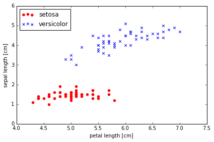


<br>
<br>

### Training the perceptron model


```python
ppn = Perceptron(eta=0.1, n_iter=10)
ppn.fit(X, y)
ppn.errors_
```


    [2, 2, 3, 2, 1, 0, 0, 0, 0, 0]


```python
# error 画图, 检查是否 error 趋近于0 在多次 loop 更新后
plt.plot(range(1, len(ppn.errors_) + 1), ppn.errors_, marker='o')
plt.xlabel('Epochs')
plt.ylabel('Number of misclassifications')

plt.tight_layout()
# plt.savefig('./perceptron_1.png', dpi=300)
```


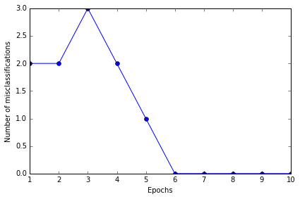


结果 error 的确最后为 0, 证明是 convergent 的, 且分类效果应该说是非常准确了

<br>
<br>

### A function for plotting decision regions
这个函数用于画决策边界


```python
from matplotlib.colors import ListedColormap
# Colormap object generated from a list of colors.

def plot_decision_regions(X, y, classifier, resolution=0.02):

    # setup marker generator and color map
    markers = ('s', 'x', 'o', '^', 'v')
    colors = ('red', 'blue', 'lightgreen', 'gray', 'cyan')
    cmap = ListedColormap(colors[:len(np.unique(y))])

    # plot the decision surface 确定横纵轴边界
    x1_min, x1_max = X[:, 0].min() - 1, X[:, 0].max() + 1  # 最小-1, 最大+1
    x2_min, x2_max = X[:, 1].min() - 1, X[:, 1].max() + 1

    # create a pair of grid arrays
    # flatten the grid arrays then predict
    xx1, xx2 = np.meshgrid(np.arange(x1_min, x1_max, resolution),
                         np.arange(x2_min, x2_max, resolution))
    Z = classifier.predict(np.array([xx1.ravel(), xx2.ravel()]).T)
    Z = Z.reshape(xx1.shape)

    # maps the different decision regions to different colors
    plt.contourf(xx1, xx2, Z, alpha=0.4, cmap=cmap)
    plt.xlim(xx1.min(), xx1.max())
    plt.ylim(xx2.min(), xx2.max())

    # plot class samples
    for idx, cl in enumerate(np.unique(y)):
        plt.scatter(x=X[y == cl, 0], y=X[y == cl, 1],
                    alpha=0.8, c=cmap(idx),
                    marker=markers[idx], label=cl)
```


```python
plot_decision_regions(X, y, classifier=ppn)
plt.xlabel('sepal length [cm]')
plt.ylabel('petal length [cm]')
plt.legend(loc='upper left')

plt.tight_layout()
# plt.savefig('./perceptron_2.png', dpi=300)
```


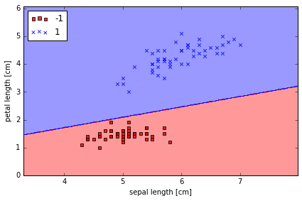


虽然 Perceptron Model 在上面 Iris 例子里表现得很好，但在其他问题上却不一定表现得好。
Frank Rosenblatt 从数学上证明了，在线性可分的数据里，Perceptron 的学习规则会 converge，但在线性不可分的情况下，却无法 converge

<br>
<br>

# Adaptive linear neurons and the convergence of learning (Adaline)

[[back to top](#Sections)]

## Implementing an adaptive linear neuron in Python

[[back to top](#Sections)]

ADAptive LInear NEuron classifier 也是一个单层神经网络. 它的重点就是定义及最优化 cost function, 对于理解更高层次更难的机器学习分类模型是非常好的入门.

它与 Perceptron 不同的地方在于更新 weights 时是用的 linear activation function, 而不是unit step function.

Adaline 中这个 linear activation function 输出等于输入, $$ φ(w^T x)=w^T x$$.

然后 activation 后会有一个 quantizer 用来学习更新 weights

定义 cost function 为 SSE: Sum of Squared Errors
$$ \displaystyle J(w)= \frac 1 2 \sum_i(y^{(i)} −\phi(z^{(i)}))^2$$

这个 function 是可导的, 并且是 convex 的, 可以进行最优化, 使用 gradient descent 算法.


```python
class AdalineGD(object):
    """ADAptive LInear NEuron classifier.

    Parameters
    ------------
    eta : float
        Learning rate (between 0.0 and 1.0)
    n_iter : int
        Passes over the training dataset.

    Attributes
    -----------
    w_ : 1d-array
        Weights after fitting.
    errors_ : list
        Number of misclassifications in every epoch.

    """
    def __init__(self, eta=0.01, n_iter=50):
        self.eta = eta
        self.n_iter = n_iter

    def fit(self, X, y):
        """ Fit training data.

        Parameters
        ----------
        X : {array-like}, shape = [n_samples, n_features]
            Training vectors, where n_samples is the number of samples and
            n_features is the number of features.
        y : array-like, shape = [n_samples]
            Target values.

        Returns
        -------
        self : object

        """
        self.w_ = np.zeros(1 + X.shape[1])
        self.cost_ = []

        # gradient descent
        for i in range(self.n_iter):
            output = self.net_input(X)
            errors = (y - output)
            self.w_[1:] += self.eta * X.T.dot(errors)
            self.w_[0] += self.eta * errors.sum()
            cost = (errors**2).sum() / 2.0
            self.cost_.append(cost) # cost list, to check algorithm convergence
        return self

    def net_input(self, X):
        """Calculate net input"""
        return np.dot(X, self.w_[1:]) + self.w_[0]

    def activation(self, X):
        """Compute linear activation"""
        return self.net_input(X)

    def predict(self, X):
        """Return class label after unit step"""
        return np.where(self.activation(X) >= 0.0, 1, -1)
```


```python
# 测试两种 learning rate, 0.01 和 0.0001
fig, ax = plt.subplots(nrows=1, ncols=2, figsize=(8, 4))

ada1 = AdalineGD(n_iter=10, eta=0.01).fit(X, y)
ax[0].plot(range(1, len(ada1.cost_) + 1), np.log10(ada1.cost_), marker='o')
ax[0].set_xlabel('Epochs')
ax[0].set_ylabel('log(Sum-squared-error)')
ax[0].set_title('Adaline - Learning rate 0.01')

ada2 = AdalineGD(n_iter=10, eta=0.0001).fit(X, y)
ax[1].plot(range(1, len(ada2.cost_) + 1), ada2.cost_, marker='o')
ax[1].set_xlabel('Epochs')
ax[1].set_ylabel('Sum-squared-error')
ax[1].set_title('Adaline - Learning rate 0.0001')

plt.tight_layout()
# plt.savefig('./adaline_1.png', dpi=300)
```


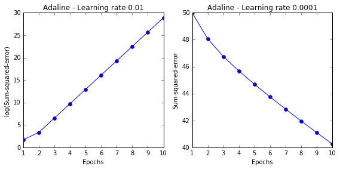


左图显示 learning rate 太大, error 没有变小, 反而变大了.

右图显示 learning rate 太小, error 变化速度太小

<br>
<br>

#### Standardizing features and re-training adaline
$$ x^\prime_j = \frac {x_j - \mu_j} {\sigma_j} $$


```python
# standardize features
X_std = np.copy(X)
X_std[:,0] = (X[:,0] - X[:,0].mean()) / X[:,0].std()
X_std[:,1] = (X[:,1] - X[:,1].mean()) / X[:,1].std()
```


```python
ada = AdalineGD(n_iter=15, eta=0.01)
ada.fit(X_std, y)

plot_decision_regions(X_std, y, classifier=ada)
plt.title('Adaline - Gradient Descent')
plt.xlabel('sepal length [standardized]')
plt.ylabel('petal length [standardized]')
plt.legend(loc='upper left')
plt.tight_layout()
# plt.savefig('./adaline_2.png', dpi=300)
plt.show()

plt.plot(range(1, len(ada.cost_) + 1), ada.cost_, marker='o')
plt.xlabel('Epochs')
plt.ylabel('Sum-squared-error')

plt.tight_layout()
# plt.savefig('./adaline_3.png', dpi=300)
```


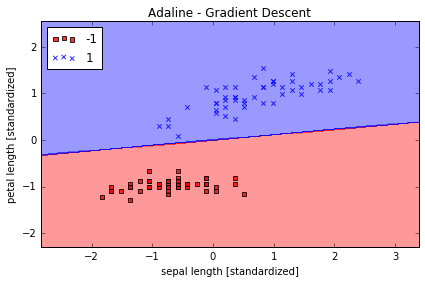


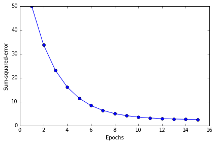


分类效果不错, error 最终接近于0
值得注意的是，虽然我们的分类全部正确，但 error 也不等于0


```python
ada.w_ #weights
```


    array([  1.36557432e-16,  -1.26256159e-01,   1.10479201e+00])


<br>
<br>

### Large scale machine learning and stochastic gradient descent

[Stochastic gradient descent 随机梯度下降](https://en.wikipedia.org/wiki/Stochastic_gradient_descent) 比一般的梯度下降更有优势, 因为每一步计算的 cost 更小, 每一步更新都是随机取其中一小步更新就可.


batch gradient descent 一次更新需要计算一遍整个数据集
$$ \Delta w = \eta \sum_i (y^{(i)} - \phi(z^{(i)}))x^{(i)} $$

stochastic gradient descent 一次更新只需计算一个数据点
$$ \Delta w = \eta(y^{(i)} - \phi(z^{(i)}))x^{(i)} $$


```python
class AdalineSGD(object):
    """ADAptive LInear NEuron classifier.

    Parameters
    ------------
    eta : float
        Learning rate (between 0.0 and 1.0)
    n_iter : int
        Passes over the training dataset.

    Attributes
    -----------
    w_ : 1d-array
        Weights after fitting.
    errors_ : list
        Number of misclassifications in every epoch.
    shuffle : bool (default: True)
        Shuffles training data every epoch if True to prevent cycles.
    random_state : int (default: None)
        Set random state for shuffling and initializing the weights.

    """
    def __init__(self, eta=0.01, n_iter=10, shuffle=True, random_state=None):
        self.eta = eta
        self.n_iter = n_iter
        self.w_initialized = False
        self.shuffle = shuffle
        if random_state:  # allow the specication of a random seed for consistency
            np.random.seed(random_state)

    def fit(self, X, y):
        """ Fit training data.

        Parameters
        ----------
        X : {array-like}, shape = [n_samples, n_features]
            Training vectors, where n_samples is the number of samples and
            n_features is the number of features.
        y : array-like, shape = [n_samples]
            Target values.

        Returns
        -------
        self : object

        """
        self._initialize_weights(X.shape[1])
        self.cost_ = []
        for i in range(self.n_iter):
            if self.shuffle:
                X, y = self._shuffle(X, y)
            cost = []
            for xi, target in zip(X, y):
                cost.append(self._update_weights(xi, target))
            avg_cost = sum(cost) / len(y)
            self.cost_.append(avg_cost)
        return self

    # 在每个 epoch 前是否 shuffle data
    def _shuffle(self, X, y):
        """Shuffle training data"""
        r = np.random.permutation(len(y))
        return X[r], y[r]

    def _initialize_weights(self, m):
        """Initialize weights to zeros"""
        self.w_ = np.zeros(1 + m)
        self.w_initialized = True

    #stochastic gradient descent
    def _update_weights(self, xi, target):
        """Apply Adaline learning rule to update the weights"""
        output = self.net_input(xi)
        error = (target - output)
        self.w_[1:] += self.eta * xi.dot(error) # 仅一个 error 相乘
        self.w_[0] += self.eta * error # 仅仅是一个 error, 而非 sum
        cost = 0.5 * error**2
        return cost

    def net_input(self, X):
        """Calculate net input"""
        return np.dot(X, self.w_[1:]) + self.w_[0]

    def activation(self, X):
        """Compute linear activation"""
        return self.net_input(X)

    def predict(self, X):
        """Return class label after unit step"""
        return np.where(self.activation(X) >= 0.0, 1, -1)
```


```python
# plot result
ada = AdalineSGD(n_iter=15, eta=0.01, random_state=1)
ada.fit(X_std, y)

plot_decision_regions(X_std, y, classifier=ada)
plt.title('Adaline - Stochastic Gradient Descent')
plt.xlabel('sepal length [standardized]')
plt.ylabel('petal length [standardized]')
plt.legend(loc='upper left')

plt.tight_layout()
#plt.savefig('./adaline_4.png', dpi=300)
plt.show()

plt.plot(range(1, len(ada.cost_) + 1), ada.cost_, marker='o')
plt.xlabel('Epochs')
plt.ylabel('Average Cost')

plt.tight_layout()
# plt.savefig('./adaline_5.png', dpi=300)
```


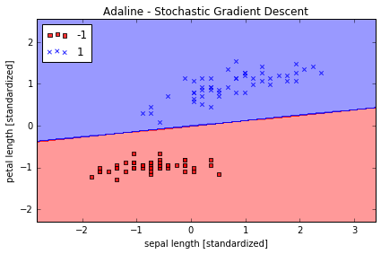


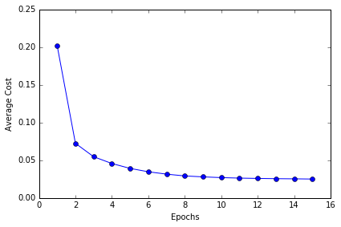


对比可以发现，Stochastic gradient descent 的学习速率比 Batch gradient descnent 的高很多

<br>
<br>

# Implementing logistic regression in Python

[[back to top](#Sections)]

logistic regression:  powerful algorithm for linear and binary classication problems

odds ratio: the odds in favor of a particular event.$$\displaystyle \frac{p}{(1-p)}$$, if p stands for the probability of the positive event, we want to predict.$$\displaystyle logit(p) = log\frac{p}{1-p}$$

and $$\displaystyle p(y=1|x)$$ is conditional probability that a particular sample belongs to
class 1 given its features x. Therefore, the logit is $$\displaystyle logit(p(y=1|x)) = w_0x_0 + w_1x_1 + ... + w_mx_m = \sum_{i=0}^nw_ix_i$$

we want to know the probability, which is inverse of logit function, we call it logistic funcition, or **sigmoid function**.
$$\displaystyle \phi (z) = \frac{1}{1+e^{-z}}$$

output of sigmoid function is as the probability of particular sample belonging to class 1

### Plot sigmoid function:


```python
%matplotlib inline
import matplotlib.pyplot as plt
import numpy as np

def sigmoid(z):
    return 1.0 / (1.0 + np.exp(-z))

z = np.arange(-7, 7, 0.1)
phi_z = sigmoid(z)

plt.plot(z, phi_z)
plt.axvline(0.0, color='k')
plt.ylim(-0.1, 1.1)
plt.xlabel('z')
plt.ylabel('$\phi (z)$')

# y axis ticks and gridline
plt.yticks([0.0, 0.5, 1.0])
ax = plt.gca()
ax.yaxis.grid(True)

plt.tight_layout()
# plt.savefig('./figures/sigmoid.png', dpi=300)
```


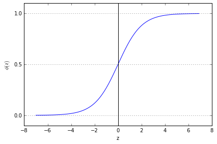


when $$\phi(z)$$ approached 1 if z→$$\infty$$, goes to 1 if z→$$-\infty$$

### Plot cost function:
use log-likelihood function to redefine cost function

then $$\displaystyle J(\phi(z),y;w)={\begin{cases}-log(\phi(z))&{\text{if }}y=1\\-log(1-\phi(z))&{\text{if }}y=0\end{cases}}$$


```python
def cost_1(z):
    return - np.log(sigmoid(z))

def cost_0(z):
    return - np.log(1 - sigmoid(z))

z = np.arange(-10, 10, 0.1)
phi_z = sigmoid(z)

c1 = [cost_1(x) for x in z]
plt.plot(phi_z, c1, label='J(w) if y=1')

c0 = [cost_0(x) for x in z]
plt.plot(phi_z, c0, linestyle='--', label='J(w) if y=0')

plt.ylim(0.0, 5.1)
plt.xlim([0, 1])
plt.xlabel('$\phi$(z)')
plt.ylabel('J(w)')
plt.legend(loc='best')
plt.tight_layout()
# plt.savefig('./figures/log_cost.png', dpi=300)

# this illustrates the cost for the classification of a single-sample instance for diff values of phi(z)
```


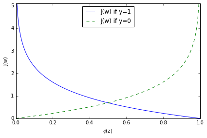


cost 趋近于0 如果正确预测 class.

### Implement in Python

The following implementation is similar to the Adaline implementation except that we replace the sum of squared errors cost function with the logistic cost function

$$J(\mathbf{w}) = \sum_{i=1}^{m} - y^{(i)} log \bigg( \phi\big(z^{(i)}\big) \bigg) - \big(1 - y^{(i)}\big) log\bigg(1-\phi\big(z^{(i)}\big)\bigg).$$


```python
class LogisticRegression(object):
    """LogisticRegression classifier.

    Parameters
    ------------
    eta : float
        Learning rate (between 0.0 and 1.0)
    n_iter : int
        Passes over the training dataset.

    Attributes
    -----------
    w_ : 1d-array
        Weights after fitting.
    cost_ : list
        Cost in every epoch.

    """
    def __init__(self, eta=0.01, n_iter=50):
        self.eta = eta
        self.n_iter = n_iter

    def fit(self, X, y):
        """ Fit training data.

        Parameters
        ----------
        X : {array-like}, shape = [n_samples, n_features]
            Training vectors, where n_samples is the number of samples and
            n_features is the number of features.
        y : array-like, shape = [n_samples]
            Target values.

        Returns
        -------
        self : object

        """
        self.w_ = np.zeros(1 + X.shape[1])
        self.cost_ = []
        for i in range(self.n_iter):
            y_val = self.activation(X)
            errors = (y - y_val)
            neg_grad = X.T.dot(errors)
            self.w_[1:] += self.eta * neg_grad
            self.w_[0] += self.eta * errors.sum()
            self.cost_.append(self._logit_cost(y, self.activation(X)))
        return self

    def _logit_cost(self, y, y_val):
        logit = -y.dot(np.log(y_val)) - ((1 - y).dot(np.log(1 - y_val)))
        return logit

    def _sigmoid(self, z):
        return 1.0 / (1.0 + np.exp(-z))

    def net_input(self, X):
        """Calculate net input"""
        return np.dot(X, self.w_[1:]) + self.w_[0]

    def activation(self, X):
        """ Activate the logistic neuron"""
        z = self.net_input(X)
        return self._sigmoid(z)

    def predict_proba(self, X):
        """
        Predict class probabilities for X.

        Parameters
        ----------
        X : {array-like, sparse matrix}, shape = [n_samples, n_features]
            Training vectors, where n_samples is the number of samples and
            n_features is the number of features.

        Returns
        ----------
          Class 1 probability : float

        """
        return activation(X)

    def predict(self, X):
        """
        Predict class labels for X.

        Parameters
        ----------
        X : {array-like, sparse matrix}, shape = [n_samples, n_features]
            Training vectors, where n_samples is the number of samples and
            n_features is the number of features.

        Returns
        ----------
        class : int
            Predicted class label.

        """
        # equivalent to np.where(self.activation(X) >= 0.5, 1, 0)
        return np.where(self.net_input(X) >= 0.0, 1, 0)
```


```python
y[y == -1] = 0  # 将负性标签编码为 0
y
```


    array([0, 0, 0, 0, 0, 0, 0, 0, 0, 0, 0, 0, 0, 0, 0, 0, 0, 0, 0, 0, 0, 0, 0,
           0, 0, 0, 0, 0, 0, 0, 0, 0, 0, 0, 0, 0, 0, 0, 0, 0, 0, 0, 0, 0, 0, 0,
           0, 0, 0, 0, 1, 1, 1, 1, 1, 1, 1, 1, 1, 1, 1, 1, 1, 1, 1, 1, 1, 1, 1,
           1, 1, 1, 1, 1, 1, 1, 1, 1, 1, 1, 1, 1, 1, 1, 1, 1, 1, 1, 1, 1, 1, 1,
           1, 1, 1, 1, 1, 1, 1, 1])


```python
lr = LogisticRegression(n_iter=500, eta=0.02).fit(X_std, y)
plt.plot(range(1, len(lr.cost_) + 1), np.log10(lr.cost_))
plt.xlabel('Epochs')
plt.ylabel('Cost')
plt.title('Logistic Regression - Learning rate 0.02')

plt.tight_layout()
```


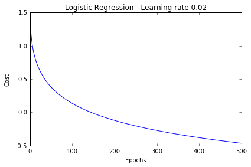


```python
plot_decision_regions(X_std, y, classifier=lr)
plt.title('Logistic Regression - Gradient Descent')
plt.xlabel('sepal length [standardized]')
plt.ylabel('petal length [standardized]')
plt.legend(loc='upper left')
plt.tight_layout()
```


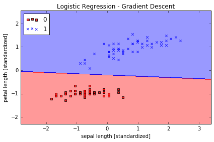


<br>
<br>

# Classification with scikit-learn

[[back to top](#Sections)]

## Loading and preprocessing the data

[[back to top](#Sections)]

Loading the **Iris dataset** from scikit-learn. Here, the third column represents the petal length, and the fourth column the petal width of the flower samples. The classes are already converted to integer labels where 0=Iris-Setosa, 1=Iris-Versicolor, 2=Iris-Virginica.


```python
from sklearn import datasets
import numpy as np

iris = datasets.load_iris()
X = iris.data[:, [2, 3]]
y = iris.target

print('Class labels:', np.unique(y))
print(iris.target_names)
```

    ('Class labels:', array([0, 1, 2]))
    ['setosa' 'versicolor' 'virginica']


Splitting data into 70% training and 30% test data:


```python
from sklearn.cross_validation import train_test_split

X_train, X_test, y_train, y_test = train_test_split(
         X, y, test_size=0.3, random_state=0)
```

Standardizing the features:


```python
from sklearn.preprocessing import StandardScaler

sc = StandardScaler()
sc.fit(X_train)
X_train_std = sc.transform(X_train) # standardize by mean & std
X_test_std = sc.transform(X_test)
```

<br>
<br>

## Other Available Data

[[back to top](#Sections)]

[Scikit-learn makes available a host of datasets for testing learning algorithms](http://scikit-learn.org/stable/datasets/#dataset-loading-utilities).
They come in three flavors:

- **Packaged Data:** these small datasets are packaged with the scikit-learn installation,
  and can be downloaded using the tools in ``sklearn.datasets.load_*``
- **Downloadable Data:** these larger datasets are available for download, and scikit-learn
  includes tools which streamline this process.  These tools can be found in
  ``sklearn.datasets.fetch_*``
- **Generated Data:** there are several datasets which are generated from models based on a
  random seed.  These are available in the ``sklearn.datasets.make_*``

You can explore the available dataset loaders, fetchers, and generators using IPython's
tab-completion functionality.  After importing the ``datasets`` submodule from ``sklearn``,
type

    datasets.load_<TAB>

or

    datasets.fetch_<TAB>

or

    datasets.make_<TAB>

to see a list of available functions.


The data downloaded using the ``fetch_`` scripts are stored locally,
within a subdirectory of your home directory.
You can use the following to determine where it is:

```
from sklearn.datasets import get_data_home
get_data_home()
```

<br>
<br>

## Training a perceptron via scikit-learn

[[back to top](#Sections)]


```python
from sklearn.linear_model import Perceptron
# sklearn 中有封装好的 Perceptron 函数
ppn = Perceptron(n_iter=40, eta0=0.1, random_state=0)
ppn.fit(X_train_std, y_train)
```


    Perceptron(alpha=0.0001, class_weight=None, eta0=0.1, fit_intercept=True,
          n_iter=40, n_jobs=1, penalty=None, random_state=0, shuffle=True,
          verbose=0, warm_start=False)


```python
y_test.shape
```


    (45,)


```python
y_pred = ppn.predict(X_test_std) # predict
print('Misclassified samples: %d' % (y_test != y_pred).sum()) # 错误个数
```

    Misclassified samples: 4


```python
from sklearn.metrics import accuracy_score

print('Accuracy: %.2f' % accuracy_score(y_test, y_pred)) # 91% 的准确率
```

    Accuracy: 0.91


```python
from matplotlib.colors import ListedColormap
import matplotlib.pyplot as plt
%matplotlib inline

# 重新定义画决策边界函数, 使得能区分训练数据和测试数据
def plot_decision_regions(X, y, classifier, test_idx=None, resolution=0.02):

    # setup marker generator and color map
    markers = ('s', 'x', 'o', '^', 'v')
    colors = ('red', 'blue', 'lightgreen', 'gray', 'cyan')
    cmap = ListedColormap(colors[:len(np.unique(y))])

    # plot the decision surface
    x1_min, x1_max = X[:, 0].min() - 1, X[:, 0].max() + 1
    x2_min, x2_max = X[:, 1].min() - 1, X[:, 1].max() + 1
    xx1, xx2 = np.meshgrid(np.arange(x1_min, x1_max, resolution),
                         np.arange(x2_min, x2_max, resolution))
    Z = classifier.predict(np.array([xx1.ravel(), xx2.ravel()]).T)
    Z = Z.reshape(xx1.shape)
    plt.contourf(xx1, xx2, Z, alpha=0.4, cmap=cmap)
    plt.xlim(xx1.min(), xx1.max())
    plt.ylim(xx2.min(), xx2.max())

    # plot all samples
    for idx, cl in enumerate(np.unique(y)):
        plt.scatter(x=X[y == cl, 0], y=X[y == cl, 1],
                    alpha=0.8, c=cmap(idx),
                    marker=markers[idx], label=cl)

    # highlight test samples
    if test_idx:
        X_test, y_test = X[test_idx, :], y[test_idx]
        plt.scatter(X_test[:, 0], X_test[:, 1], c='',
                alpha=1.0, linewidth=1, marker='o',
                s=55, label='test set')
```

Training a perceptron model using the standardized training data:


```python
X_combined_std = np.vstack((X_train_std, X_test_std))
y_combined = np.hstack((y_train, y_test))

plot_decision_regions(X=X_combined_std, y=y_combined,
                      classifier=ppn, test_idx=range(105,150))
plt.xlabel('petal length [standardized]')
plt.ylabel('petal width [standardized]')
plt.legend(loc='upper left')

plt.tight_layout()
# plt.savefig('./figures/iris_perceptron_scikit.png', dpi=300)
# 这次是3个分类一起
```


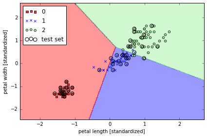


Peceptron 模型对于并不是完全线性隔离的 dataset 不能 converge, 所以实际应用中并不多用.
<br>
<br>

<br>
<br>

## Modeling class probabilities via logistic regression

[[back to top](#Sections)]


```python
# use Logistic Regression
from sklearn.linear_model import LogisticRegression
# C parameter 是什么呢?
lr = LogisticRegression(C=1000.0, random_state=0)
lr.fit(X_train_std, y_train)

plot_decision_regions(X_combined_std, y_combined,
                      classifier=lr, test_idx=range(105,150))
plt.xlabel('petal length [standardized]')
plt.ylabel('petal width [standardized]')
plt.legend(loc='upper left')
plt.tight_layout()
# plt.savefig('./figures/logistic_regression.png', dpi=300)
```


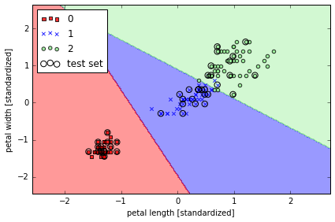


```python
lr.predict_proba(X_test_std[0,:].reshape(1,-1)) # predict probability
```


    array([[  2.05743774e-11,   6.31620264e-02,   9.36837974e-01]])


### Regularization path
解决 overfitting: 模型拟合的过好, 以致于没有一般性, 预测新的样本的结果就会很差

一般过拟合的模型会有 high variance

最常用的解决方法就叫做 L2 regulatization$$\displaystyle \frac{\lambda}{2} \lVert w \rVert^2 = \frac{\lambda}{2}\sum_{j=1}^m w_j^2$$

其中$$\lambda$$ 就是 regularization parameter, 可以用来控制拟合训练数据的好坏, 而 $$C = \frac{1}{\lambda}$$ 就是前面提到过的 parameter


```python
weights, params = [], []
for c in np.arange(-5, 5):
    lr = LogisticRegression(C=10**c, random_state=0)
    lr.fit(X_train_std, y_train)
    weights.append(lr.coef_[1])
    params.append(10**c)

weights = np.array(weights)
plt.plot(params, weights[:, 0],
         label='petal length')
plt.plot(params, weights[:, 1], linestyle='--',
         label='petal width')
plt.ylabel('weight coefficient')
plt.xlabel('C')
plt.legend(loc='upper left')
plt.xscale('log')
# plt.savefig('./figures/regression_path.png', dpi=300)

# C 减小的话, 就是增加 regularization
```


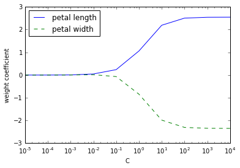


<br>
<br>

## Logistic regression with regularization


```python
class LogitGD(object):
    """Logistic Regression classifier.

    Parameters
    ------------
    eta : float
        Learning rate (between 0.0 and 1.0)
    n_iter : int
        Passes over the training dataset.

    Attributes
    -----------
    w_ : 1d-array
        Weights after fitting.
    errors_ : list
        Number of misclassifications in every epoch.

    """
    def __init__(self, eta=0.01, lamb = 0.01, n_iter=50):
        self.eta = eta
        self.n_iter = n_iter
        self.lamb = lamb

    def fit(self, X, y):
        """ Fit training data.

        Parameters
        ----------
        X : {array-like}, shape = [n_samples, n_features]
            Training vectors, where n_samples is the number of samples and
            n_features is the number of features.
        y : array-like, shape = [n_samples]
            Target values.

        Returns
        -------
        self : object

        """
        self.w_ = np.zeros(1 + X.shape[1])
        self.cost_ = []


        for i in range(self.n_iter):
            output = self.net_input(X)
            errors = (y - output)
            self.w_[1:] += self.eta * X.T.dot(errors) - self.lamb* self.w_[1:]
            self.w_[0] += self.eta * errors.sum()
            cost = (errors**2).sum() / 2.0 + self.lamb* np.sum(self.w_[1:]**2)
            self.cost_.append(cost)
        return self

    def net_input(self, X):
        """Calculate net input"""
        return np.dot(X, self.w_[1:]) + self.w_[0]

    def sigmoid(z):
        return 1.0 / (1.0 + np.exp(-z))

    def activation(self, X):
        """Compute linear activation"""
        return sigmoid(self.net_input(X))

    def predict(self, X):
        """Return class label after unit step"""
        return np.where(self.activation(X) >= 0.5, 1, -1)
```


```python

```

## 其它的分类器简介

# Maximum margin classification with support vector machines

 目的是 maximize the **margin**, margin 是分离决策边界与离之最近的训练样本之间的距离.  


[[back to top](#Sections)]


```python
# train SVC
from sklearn.svm import SVC

svm = SVC(kernel='linear', C=1.0, random_state=0)
svm.fit(X_train_std, y_train)

plot_decision_regions(X_combined_std, y_combined,
                      classifier=svm, test_idx=range(105,150))
plt.xlabel('petal length [standardized]')
plt.ylabel('petal width [standardized]')
plt.legend(loc='upper left')
plt.tight_layout()
# plt.savefig('./figures/support_vector_machine_linear.png', dpi=300)
```


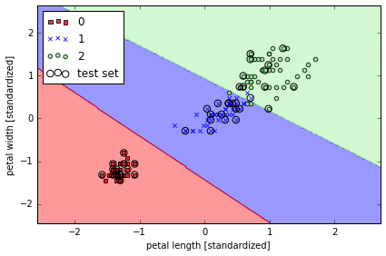


<br>
<br>

## Solving non-linear problems using a kernel SVM

SVM 可以解决非线性问题

[[back to top](#Sections)]


```python
# create a simple dataset
np.random.seed(0)
X_xor = np.random.randn(200, 2)
y_xor = np.logical_xor(X_xor[:, 0] > 0, X_xor[:, 1] > 0) # 100个 with label 1, 100 withlabel 0
y_xor = np.where(y_xor, 1, -1)

plt.scatter(X_xor[y_xor==1, 0], X_xor[y_xor==1, 1], c='b', marker='x', label='1')
plt.scatter(X_xor[y_xor==-1, 0], X_xor[y_xor==-1, 1], c='r', marker='s', label='-1')

plt.xlim([-3, 3])
plt.ylim([-3, 3])
plt.legend(loc='best')
plt.tight_layout()
# plt.savefig('./figures/xor.png', dpi=300)

# 使用普通的  linear logistic Regression 不能很好将样本分为+ve 和-ve
```


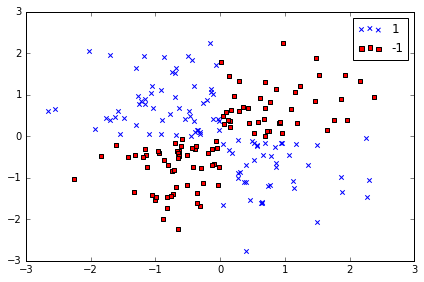


rbf 是指 radial basis function kernel 或者 Gaussian kernel

$$\displaystyle k(x^{(i)}, x^{(j)}) = exp (- \frac{\lVert x^{(i)}-x^{(j)} \rVert^2}{2 \sigma^2})$$

simplified to $$\displaystyle exp(-\gamma \lVert x^{(i)}-x^{(j)} \rVert^2)$$
with $$\gamma = \frac{1}{2\sigma^2}$$


```python
# 使用 svm kernel 方法, 投射到高纬度中, 使之成为线性可分离的
svm = SVC(kernel='rbf', random_state=0, gamma=0.10, C=10.0)
svm.fit(X_xor, y_xor)
plot_decision_regions(X_xor, y_xor,
                      classifier=svm)

plt.legend(loc='upper left')
plt.tight_layout()
# plt.savefig('./figures/support_vector_machine_rbf_xor.png', dpi=300)
```


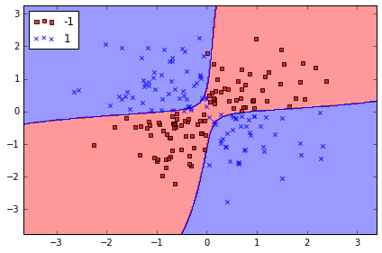


其中$$\gamma$$ parameter 可以被理解为 cut-off parameter for Gaussian sphere

当$$\gamma$$ 增加, 也就增加了训练样本的影响, 也就会使决策边界变得模糊


```python
from sklearn.svm import SVC
## gamma 较小
svm = SVC(kernel='rbf', random_state=0, gamma=0.2, C=1.0)
svm.fit(X_train_std, y_train)

plot_decision_regions(X_combined_std, y_combined,
                      classifier=svm, test_idx=range(105,150))
plt.xlabel('petal length [standardized]')
plt.ylabel('petal width [standardized]')
plt.legend(loc='upper left')
plt.tight_layout()
# plt.savefig('./figures/support_vector_machine_rbf_iris_1.png', dpi=300)
```


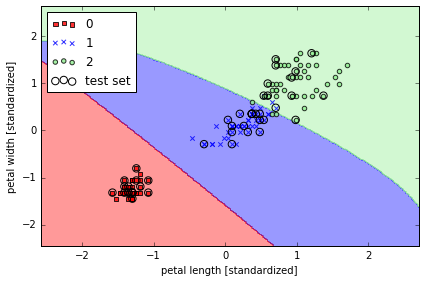


```python
# gamma 很大, 边界 tight
svm = SVC(kernel='rbf', random_state=0, gamma=100.0, C=1.0)
svm.fit(X_train_std, y_train)

plot_decision_regions(X_combined_std, y_combined,
                      classifier=svm, test_idx=range(105,150))
plt.xlabel('petal length [standardized]')
plt.ylabel('petal width [standardized]')
plt.legend(loc='upper left')
plt.tight_layout()
# plt.savefig('./figures/support_vector_machine_rbf_iris_2.png', dpi=300)
```


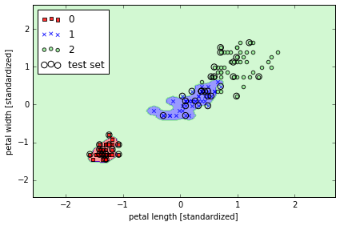


<br>
<br>

## K-nearest neighbors - a lazy learning algorithm

it doesn't learn a discriminative function from the training data but memorizes the training dataset instead.

1. Choose the number of k and a distance metric.
2. Find the k nearest neighbors of the sample that we want to classify.
3. Assign the class label by majority vote.

这种方法好处在于新数据进来, 分类器可以马上学习并适应, 但是计算成本也是线性增长, 存储也是问题.

[[back to top](#Sections)]


```python
from sklearn.neighbors import KNeighborsClassifier
# 寻找5个邻居
knn = KNeighborsClassifier(n_neighbors=5, p=2, metric='minkowski')
knn.fit(X_train_std, y_train)

plot_decision_regions(X_combined_std, y_combined,
                      classifier=knn, test_idx=range(105,150))

plt.xlabel('petal length [standardized]')
plt.ylabel('petal width [standardized]')
plt.legend(loc='upper left')
plt.tight_layout()
# plt.savefig('./figures/k_nearest_neighbors.png', dpi=300)
```


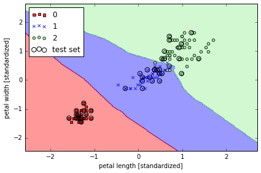


如何选择 k 是一个重点, 并且需要标准化数据. 例子中用到的'minkowski' distance 是普通的 Euclidean 和 Manhattan distance 的扩展.

$$\displaystyle d(x^{(i)}, x^{(j)}) = \sqrt[p]{\sum_k \left|x_k^{(i)}x_k^{(j)}\right|^p} $$

<br>
<br>

# Scoring metrics for classification

[[back to top](#Sections)]

## Classification metrics in Scikit-learn

[[back to top](#Sections)]

<p>The <a class="reference internal" href="http://scikit-learn.org/stable/modules/classes.html#module-sklearn.metrics" title="sklearn.metrics"><code class="xref py py-mod docutils literal"><span class="pre">sklearn.metrics</span></code></a> module implements several loss, score, and utility
functions to measure classification performance.
Some metrics might require probability estimates of the positive class,
confidence values, or binary decisions values.
Most implementations allow each sample to provide a weighted contribution
to the overall score, through the <code class="docutils literal"><span class="pre">sample_weight</span></code> parameter.</p>
<p>Some of these are restricted to the binary classification case:</p>
<table border="1" class="longtable docutils">
<colgroup>
<col width="10%">
<col width="90%">
</colgroup>
<tbody valign="top">
<tr class="row-odd"><td><a class="reference internal" href="http://scikit-learn.org/stable/modules/generated/sklearn.metrics.matthews_corrcoef.html#sklearn.metrics.matthews_corrcoef" title="sklearn.metrics.matthews_corrcoef"><code class="xref py py-obj docutils literal"><span class="pre">matthews_corrcoef</span></code></a>(y_true,&nbsp;y_pred)</td>
<td>Compute the Matthews correlation coefficient (MCC) for binary classes</td>
</tr>
<tr class="row-even"><td><a class="reference internal" href="http://scikit-learn.org/stable/modules/generated/sklearn.metrics.precision_recall_curve.html#sklearn.metrics.precision_recall_curve" title="sklearn.metrics.precision_recall_curve"><code class="xref py py-obj docutils literal"><span class="pre">precision_recall_curve</span></code></a>(y_true,&nbsp;probas_pred)</td>
<td>Compute precision-recall pairs for different probability thresholds</td>
</tr>
<tr class="row-odd"><td><a class="reference internal" href="http://scikit-learn.org/stable/modules/generated/sklearn.metrics.roc_curve.html#sklearn.metrics.roc_curve" title="sklearn.metrics.roc_curve"><code class="xref py py-obj docutils literal"><span class="pre">roc_curve</span></code></a>(y_true,&nbsp;y_score[,&nbsp;pos_label,&nbsp;...])</td>
<td>Compute Receiver operating characteristic (ROC)</td>
</tr>
</tbody>
</table>
<p>Others also work in the multiclass case:</p>
<table border="1" class="longtable docutils">
<colgroup>
<col width="10%">
<col width="90%">
</colgroup>
<tbody valign="top">
<tr class="row-odd"><td><a class="reference internal" href="http://scikit-learn.org/stable/modules/generated/sklearn.metrics.confusion_matrix.html#sklearn.metrics.confusion_matrix" title="sklearn.metrics.confusion_matrix"><code class="xref py py-obj docutils literal"><span class="pre">confusion_matrix</span></code></a>(y_true,&nbsp;y_pred[,&nbsp;labels])</td>
<td>Compute confusion matrix to evaluate the accuracy of a classification</td>
</tr>
<tr class="row-even"><td><a class="reference internal" href="http://scikit-learn.org/stable/modules/generated/sklearn.metrics.hinge_loss.html#sklearn.metrics.hinge_loss" title="sklearn.metrics.hinge_loss"><code class="xref py py-obj docutils literal"><span class="pre">hinge_loss</span></code></a>(y_true,&nbsp;pred_decision[,&nbsp;labels,&nbsp;...])</td>
<td>Average hinge loss (non-regularized)</td>
</tr>
</tbody>
</table>
<p>Some also work in the multilabel case:</p>
<table border="1" class="longtable docutils">
<colgroup>
<col width="10%">
<col width="90%">
</colgroup>
<tbody valign="top">
<tr class="row-odd"><td><a class="reference internal" href="http://scikit-learn.org/stable/modules/generated/sklearn.metrics.accuracy_score.html#sklearn.metrics.accuracy_score" title="sklearn.metrics.accuracy_score"><code class="xref py py-obj docutils literal"><span class="pre">accuracy_score</span></code></a>(y_true,&nbsp;y_pred[,&nbsp;normalize,&nbsp;...])</td>
<td>Accuracy classification score.</td>
</tr>
<tr class="row-even"><td><a class="reference internal" href="http://scikit-learn.org/stable/modules/generated/sklearn.metrics.classification_report.html#sklearn.metrics.classification_report" title="sklearn.metrics.classification_report"><code class="xref py py-obj docutils literal"><span class="pre">classification_report</span></code></a>(y_true,&nbsp;y_pred[,&nbsp;...])</td>
<td>Build a text report showing the main classification metrics</td>
</tr>
<tr class="row-odd"><td><a class="reference internal" href="http://scikit-learn.org/stable/modules/generated/sklearn.metrics.f1_score.html#sklearn.metrics.f1_score" title="sklearn.metrics.f1_score"><code class="xref py py-obj docutils literal"><span class="pre">f1_score</span></code></a>(y_true,&nbsp;y_pred[,&nbsp;labels,&nbsp;...])</td>
<td>Compute the F1 score, also known as balanced F-score or F-measure</td>
</tr>
<tr class="row-even"><td><a class="reference internal" href="http://scikit-learn.org/stable/modules/generated/sklearn.metrics.fbeta_score.html#sklearn.metrics.fbeta_score" title="sklearn.metrics.fbeta_score"><code class="xref py py-obj docutils literal"><span class="pre">fbeta_score</span></code></a>(y_true,&nbsp;y_pred,&nbsp;beta[,&nbsp;labels,&nbsp;...])</td>
<td>Compute the F-beta score</td>
</tr>
<tr class="row-odd"><td><a class="reference internal" href="http://scikit-learn.org/stable/modules/generated/sklearn.metrics.hamming_loss.html#sklearn.metrics.hamming_loss" title="sklearn.metrics.hamming_loss"><code class="xref py py-obj docutils literal"><span class="pre">hamming_loss</span></code></a>(y_true,&nbsp;y_pred[,&nbsp;classes])</td>
<td>Compute the average Hamming loss.</td>
</tr>
<tr class="row-even"><td><a class="reference internal" href="http://scikit-learn.org/stable/modules/generated/sklearn.metrics.jaccard_similarity_score.html#sklearn.metrics.jaccard_similarity_score" title="sklearn.metrics.jaccard_similarity_score"><code class="xref py py-obj docutils literal"><span class="pre">jaccard_similarity_score</span></code></a>(y_true,&nbsp;y_pred[,&nbsp;...])</td>
<td>Jaccard similarity coefficient score</td>
</tr>
<tr class="row-odd"><td><a class="reference internal" href="http://scikit-learn.org/stable/modules/generated/sklearn.metrics.log_loss.html#sklearn.metrics.log_loss" title="sklearn.metrics.log_loss"><code class="xref py py-obj docutils literal"><span class="pre">log_loss</span></code></a>(y_true,&nbsp;y_pred[,&nbsp;eps,&nbsp;normalize,&nbsp;...])</td>
<td>Log loss, aka logistic loss or cross-entropy loss.</td>
</tr>
<tr class="row-even"><td><a class="reference internal" href="http://scikit-learn.org/stable/modules/generated/sklearn.metrics.precision_recall_fscore_support.html#sklearn.metrics.precision_recall_fscore_support" title="sklearn.metrics.precision_recall_fscore_support"><code class="xref py py-obj docutils literal"><span class="pre">precision_recall_fscore_support</span></code></a>(y_true,&nbsp;y_pred)</td>
<td>Compute precision, recall, F-measure and support for each class</td>
</tr>
<tr class="row-odd"><td><a class="reference internal" href="http://scikit-learn.org/stable/modules/generated/sklearn.metrics.precision_score.html#sklearn.metrics.precision_score" title="sklearn.metrics.precision_score"><code class="xref py py-obj docutils literal"><span class="pre">precision_score</span></code></a>(y_true,&nbsp;y_pred[,&nbsp;labels,&nbsp;...])</td>
<td>Compute the precision</td>
</tr>
<tr class="row-even"><td><a class="reference internal" href="http://scikit-learn.org/stable/modules/generated/sklearn.metrics.recall_score.html#sklearn.metrics.recall_score" title="sklearn.metrics.recall_score"><code class="xref py py-obj docutils literal"><span class="pre">recall_score</span></code></a>(y_true,&nbsp;y_pred[,&nbsp;labels,&nbsp;...])</td>
<td>Compute the recall</td>
</tr>
<tr class="row-odd"><td><a class="reference internal" href="http://scikit-learn.org/stable/modules/generated/sklearn.metrics.zero_one_loss.html#sklearn.metrics.zero_one_loss" title="sklearn.metrics.zero_one_loss"><code class="xref py py-obj docutils literal"><span class="pre">zero_one_loss</span></code></a>(y_true,&nbsp;y_pred[,&nbsp;normalize,&nbsp;...])</td>
<td>Zero-one classification loss.</td>
</tr>
</tbody>
</table>
<p>And some work with binary and multilabel (but not multiclass) problems:</p>
<table border="1" class="longtable docutils">
<colgroup>
<col width="10%">
<col width="90%">
</colgroup>
<tbody valign="top">
<tr class="row-odd"><td><a class="reference internal" href="http://scikit-learn.org/stable/modules/generated/sklearn.metrics.average_precision_score.html#sklearn.metrics.average_precision_score" title="sklearn.metrics.average_precision_score"><code class="xref py py-obj docutils literal"><span class="pre">average_precision_score</span></code></a>(y_true,&nbsp;y_score[,&nbsp;...])</td>
<td>Compute average precision (AP) from prediction scores</td>
</tr>
<tr class="row-even"><td><a class="reference internal" href="http://scikit-learn.org/stable/modules/generated/sklearn.metrics.roc_auc_score.html#sklearn.metrics.roc_auc_score" title="sklearn.metrics.roc_auc_score"><code class="xref py py-obj docutils literal"><span class="pre">roc_auc_score</span></code></a>(y_true,&nbsp;y_score[,&nbsp;average,&nbsp;...])</td>
<td>Compute Area Under the Curve (AUC) from prediction scores</td>
</tr>
</tbody>
</table>


```python
# 构建数据
from sklearn import datasets
from sklearn.cross_validation import train_test_split
from sklearn.preprocessing import StandardScaler
from sklearn.svm import SVC

X, y = datasets.make_classification(n_classes=2, random_state=0)

X_train, X_test, y_train, y_test = train_test_split(
    X, y, test_size=0.3, random_state=0)

sc = StandardScaler()
sc.fit(X_train)
X_train_std = sc.transform(X_train) # standardize by mean & std
X_test_std = sc.transform(X_test)

model = SVC(probability=True, random_state=0)
model.fit(X_train_std, y_train);
```

default score for classification in sklearn is accuracy (标签预测正确的比例)

$$ accuracy(y, \hat y) = \frac 1 n \sum^{n - 1}_{i=0} 1 (\hat y_i = y_i)$$
where $$1(x)$$ is the [indicator function](http://en.wikipedia.org/wiki/Indicator_function)


```python
model.score(X_test_std, y_test)
```


    0.83333333333333337


```python
from sklearn.metrics import accuracy_score
y_pred = model.predict(X_test_std)
accuracy_score(y_test, y_pred)
```


    0.83333333333333337


<br>
<br>

## Reading a confusion matrix

[[back to top](#Sections)]


For multi-class problems, it is often interesting to know which of the classes are hard to predict, and which are easy, or which classes get confused. One way to get more information about misclassifications is ``the confusion_matrix``, which shows for each true class, how frequent a given predicted outcome is.


```python
from sklearn.metrics import confusion_matrix

y_test_pred = model.predict(X_test_std)

confmat = confusion_matrix(y_test, y_test_pred)
print(confmat)
```

    [[15  3]
     [ 2 10]]


```python
plt.matshow(confusion_matrix(y_test, y_test_pred), cmap=plt.cm.Blues)
plt.colorbar()
plt.xlabel("Predicted label")
plt.ylabel("True label");
```


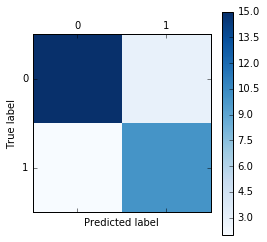


<br>
<br>

## Precision, recall and F-measures

[[back to top](#Sections)]

+ **Precision** is how many of the predictions for a class are actually that class.
+ **Recall** is how many of the true positives were recovered:
+ **f1-score** is the geometric average of precision and recall:

With TP, FP, TN, FN, FPR, TPR standing for "true positive", "false positive", "true negative" and "false negative", "false positive rate", "true positive rate" repectively:


\begin{align}
&PRE = \frac{TP}{TP+FP} \\
&REC = TPR = \frac{TP}{FN+TP} \\
&F1 = 2 \frac{PRE \times REC}{PRE+REC} \\
&F_\beta = (1+\beta^2)\frac{PRE \times REC}{\beta^2 PRE+REC} \\
&FPR = \frac{FP}{FP+TN} \\
&TPR = \frac{TP}{FN+TP}
\end{align}


```python
from sklearn.metrics import precision_score, recall_score, f1_score, fbeta_score

print('Precision: %.3f' % precision_score(y_true=y_test, y_pred=y_test_pred))
print('Recall: %.3f' % recall_score(y_true=y_test, y_pred=y_test_pred))
print('F1: %.3f' % f1_score(y_true=y_test, y_pred=y_test_pred))
print('F_beta2: %.3f' % fbeta_score(y_true=y_test, y_pred=y_test_pred, beta=2))
```

    Precision: 0.769
    Recall: 0.833
    F1: 0.800
    F_beta2: 0.820


Another useful function is the classification_report which provides precision, recall, fscore and support for all classes.


```python
from sklearn.metrics import classification_report
print(classification_report(y_test, y_test_pred))
```

                 precision    recall  f1-score   support

              0       0.88      0.83      0.86        18
              1       0.77      0.83      0.80        12

    avg / total       0.84      0.83      0.83        30


These metrics are helpful in two particular cases that come up often in practice:
1. Imbalanced classes, that is one class might be much more frequent than the other.
2. Asymmetric costs, that is one kind of error is much more "costly" than the other.

<br>
<br>

## ROC and AUC

[[back to top](#Sections)]

A [receiver operating characteristic curve, or ROC curve](http://en.wikipedia.org/wiki/Receiver_operating_characteristic), is a graphical plot which illustrates the performance of a binary classifier system as its discrimination threshold is varied. It is created by plotting the fraction of true positives out of the positives (TPR = true positive rate) vs. the fraction of false positives out of the negatives (FPR = false positive rate), at various threshold settings. TPR is also known as sensitivity, and FPR is one minus the specificity or true negative rate.


如果分类器效果很好, 那么图应该会在左上角.

在 ROC curve 的基础上, 可以计算 AUC -- area under the curve.

### Area Under Curve

The AUC is a common evaluation metric for binary classification problems.
Consider a plot of the true positive rate vs the false positive rate as the threshold value for classifying an item as 0 or is increased from 0 to 1:
if the classifier is very good, the true positive rate will increase quickly and the area under the curve will be close to 1.
If the classifier is no better than random guessing, the true positive rate will increase linearly with the false positive rate and the area under the curve will be around 0.5.

One characteristic of the AUC is that it is independent of the fraction of the test population which is class 0 or class 1: this makes the AUC useful for evaluating the performance of classifiers on unbalanced data sets.


```python
def roc_curve(true_labels, predicted_probs, n_points=100, pos_class=1):
    thr = np.linspace(0,1,n_points)
    tpr = np.zeros(n_points)
    fpr = np.zeros(n_points)

    pos = true_labels == pos_class
    neg = np.logical_not(pos)
    n_pos = np.count_nonzero(pos)
    n_neg = np.count_nonzero(neg)

    for i,t in enumerate(thr):
        tpr[i] = np.count_nonzero(np.logical_and(predicted_probs >= t, pos)) / float(n_pos)
        fpr[i] = np.count_nonzero(np.logical_and(predicted_probs >= t, neg)) / float(n_neg)

    return fpr, tpr, thr

```


```python
df_imputed = pd.read_csv('df_imputed')
```


```python
features = ['revolving_utilization_of_unsecured_lines',
 'age',
 'number_of_time30-59_days_past_due_not_worse',
 'debt_ratio',
 'monthly_income',
 'number_of_open_credit_lines_and_loans',
 'number_of_times90_days_late',
 'number_real_estate_loans_or_lines',
 'number_of_time60-89_days_past_due_not_worse',
 'number_of_dependents',
 'income_bins',
 'age_bin',
 'monthly_income_scaled']
y = df_imputed.serious_dlqin2yrs
X = pd.get_dummies(df_imputed[features], columns = ['income_bins', 'age_bin'])
```


```python
from sklearn.cross_validation import train_test_split
train_X, test_X, train_y, test_y = train_test_split(X, y ,train_size=0.7,random_state=1)
```


```python
# Randomly generated predictions should give us a diagonal ROC curve
preds = np.random.rand(len(test_y))
fpr, tpr, thr = roc_curve(test_y, preds)
plt.plot(fpr, tpr);
```


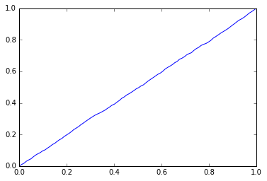


```python
from sklearn.linear_model import LogisticRegression
clf = LogisticRegression()
clf.fit(train_X,train_y)
preds = clf.predict_proba(test_X)[:,1]
fpr, tpr, thr = roc_curve(test_y, preds)
plt.plot(fpr, tpr);
```


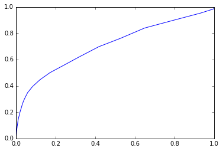


<br>
<br>

## Log loss

[[back to top](#Sections)]

Log loss, also called logistic regression loss or cross-entropy loss, is defined on probability estimates.
It is commonly used in (multinomial) logistic regression and neural networks,
as well as in some variants of expectation-maximization,
and can be used to evaluate the probability outputs (`predict_proba`)
of a classifier instead of its discrete predictions.

For binary classification with a true label $$y \in \{0,1\}$$ and a probability estimate $$p = \operatorname{Pr}(y = 1)$$,
the log loss per sample is the negative log-likelihood of the classifier given the true label:

$$ L_{log}(y, p) = -log Pr(y|p) = -(y log(p) + (1-y) log(1-p)) $$

This extends to the multiclass case as follows. Let the true labels for a set of samples be encoded as a 1-of-K binary indicator matrix $$Y$$,
i.e., $$y_{i,k} = 1$$ if sample $$i$$ has label $$k$$ taken from a set of $$K$$ labels.
Let $$P$$ be a matrix of probability estimates, with $$p_{i,k} = \operatorname{Pr}(t_{i,k} = 1)$$.
Then the log loss of the whole set is

$$L_{log}(Y, P) = -logPr(Y|P) = - \frac 1 N \sum^{N-1}_{i=0} \sum^{K-1}_{k=0} y_{i,k}logp_{i,k} $$

To see how this generalizes the binary log loss given above, note that in the binary case,
we have $$p_{i,0} = 1 - p_{i,1}$$ and $$y_{i,0} = 1 - y_{i,1}$$,
so expanding the inner sum over $$y_{i,k} \in \{0,1\}$$ gives the binary log loss.

The [log_loss](http://scikit-learn.org/stable/modules/generated/sklearn.metrics.log_loss.html#sklearn.metrics.log_loss) function computes log loss given a list of ground-truth labels and a probability matrix, as returned by an estimator’s predict_proba method.


```python
from sklearn.metrics import log_loss
y_true = [0, 0, 1, 1]
y_pred = [[.9, .1], [.8, .2], [.3, .7], [.01, .99]]
log_loss(y_true, y_pred)
```


    0.17380733669106749


## Hinge loss

[[back to top](#Sections)]

The [hinge_loss](http://scikit-learn.org/stable/modules/generated/sklearn.metrics.hinge_loss.html#sklearn.metrics.hinge_loss) function computes the average distance between
the model and the data using [hinge loss](http://en.wikipedia.org/wiki/Hinge_loss), a one-sided metric that considers only prediction errors. (Hinge loss is used in maximal margin classifiers such as support vector machines.)

If the labels are encoded with +1 and -1,  $$y$$:
is the true value, and $w$ is the predicted decisions as output by decision_function,
then the hinge loss is defined as:

$$ L_{Hinge}(y, w) = max\{1-wy, 0\} = |1-wy|_+ $$


If there are more than two labels, hinge_loss uses a multiclass variant due to Crammer & Singer.
If $$y_w$$ is the predicted decision for true label and $$y_t$$ is the maximum of the predicted decisions for all other labels,
where predicted decisions are output by decision function, then multiclass hinge loss is defined by:

$$ L_{Hinge}(y_w, y_t) = max\{1+y_t-y_w,0\}$$


```python
# Here a small example demonstrating the use of the hinge_loss function
# with a svm classifier in a binary class problem:
from sklearn import svm
from sklearn.metrics import hinge_loss
X = [[0], [1]]
y = [-1, 1]
est = svm.LinearSVC(random_state=0)
est.fit(X, y)
pred_decision = est.decision_function([[-2], [3], [0.5]])
print(pred_decision)
print(hinge_loss([-1, 1, 1], pred_decision))
```

    [-2.18173682  2.36360149  0.09093234]
    0.303022554204


```python
# Here is an example demonstrating the use of the hinge_loss function
# with a svm classifier in a multiclass problem:
X = np.array([[0], [1], [2], [3]])
Y = np.array([0, 1, 2, 3])
labels = np.array([0, 1, 2, 3])
est = svm.LinearSVC()
est.fit(X, Y)
pred_decision = est.decision_function([[-1], [2], [3]])
y_true = [0, 2, 3]
hinge_loss(y_true, pred_decision, labels)
```


    0.56412359941917456


## 练习：尝试在信贷数据集中使用正则化方法， 画出系数的变化，以及最终的预测效果


```python

```
