## Sections
- [What is Feature Engineering?](#What-is-Feature-Engineering?)
- [Data preprocessing](#Data-preprocessing)
    - [Dealing with missing data](#Dealing-with-missing-data)
        - [Eliminating samples or features with missing values](#Eliminating-samples-or-features-with-missing-values)
        - [Imputing missing values](#Imputing-missing-values)
    - [Handling categorical data](#Handling-categorical-data)
        - [Mapping ordinal features](#Mapping-ordinal-features)
        - [Encoding class labels](#Encoding-class-labels)
        - [Performing one-hot encoding on nominal features](#Performing-one-hot-encoding-on-nominal-features)
    - [Partitioning a dataset in training and test sets](#Partitioning-a-dataset-in-training-and-test-sets)
    - [Bringing features onto the same scale](#Bringing-features-onto-the-same-scale)

- [Feature selection](#Feature-selection)
    - [Univariate statistics](#Univariate-statistics)
    - [Recursive feature elimination](#Recursive-feature-elimination)
    - [Feature selection using SelectFromModel](#Feature-selection-using-SelectFromModel)
        - [L1-based feature selection](#L1-based-feature-selection)
        - [Tree-based feature selection](#Tree-based-feature-selection)
    
- [Feature extraction](#Feature-extraction)    
    - [Unsupervised dimensionality reduction via principal component analysis](#Unsupervised-dimensionality-reduction-via-principal-component-analysis)
        - [Total and explained variance](#Total-and-explained-variance)
        - [Feature transformation](#Feature-transformation)
        - [Principal component analysis in scikit-learn](#Principal-component-analysis-in-scikit-learn)
    - [Supervised data compression via linear discriminant analysis](#Supervised-data-compression-via-linear-discriminant-analysis)
        - [Computing the scatter matrices](#Computing-the-scatter-matrices)
        - [Selecting linear discriminants for the new feature subspace](#Selecting-linear-discriminants-for-the-new-feature-subspace)
        - [Projecting samples onto the new feature space](#Projecting-samples-onto-the-new-feature-space)
        - [LDA via scikit-learn](#LDA-via-scikit-learn)
    - [Using kernel principal component analysis for nonlinear mappings](#Using-kernel-principal-component-analysis-for-nonlinear-mappings)
        - [Implementing a kernel principal component analysis in Python](#Implementing-a-kernel-principal-component-analysis-in-Python)
        - [Example 1: Separating half-moon shapes](#Example-1:-Separating-half-moon-shapes)
        - [Example 2: Separating concentric circles](#Example-2:-Separating-concentric-circles)
        - [Projecting new data points](#Projecting-new-data-points)
        - [Kernel principal component analysis in scikit-learn](#Kernel-principal-component-analysis-in-scikit-learn)
- [Using regularization](#Using-regularization)
    - [Ridge Regression](#Ridge-Regression)
    - [LASSO Regression](#LASSO-Regression)
    - [Logistic regression with regularization](#Logistic-regression-with-regularization)

<br>
<br>

## What is Feature Engineering?

[[back to top](#Sections)]

Feature engineering is the process of transforming raw data into features that better represent the underlying problem to the predictive models, resulting in improved model accuracy on unseen data.

### Sub-Problems of Feature Engineering
- Feature Importance: An estimate of the usefulness of a feature
- Feature Selection: From many features to a few that are useful
- Feature Extraction: The automatic construction of new features from raw data
- Feature Construction: The manual construction of new features from raw data

### Iterative Process of Feature Engineering
- Brainstorm features: Really get into the problem, look at a lot of data, study feature engineering on other problems and see what you can steal.
- Devise features: Depends on your problem, but you may use automatic feature extraction, manual feature construction and mixtures of the two.
- Select features: Use different feature importance scorings and feature selection methods to prepare one or more “views” for your models to operate upon.
- Evaluate models: Estimate model accuracy on unseen data using the chosen features.


### General Examples of Feature Engineering
- Decompose Categorical Attributes
    - Imagine you have a categorical attribute, like “Item_Color” that can be Red, Blue or Unknown.
- Decompose a Date-Time
    - A date-time contains a lot of information that can be difficult for a model to take advantage of in it’s native form, such as ISO 8601 (i.e. 2014-09-20T20:45:40Z).
- Reframe Numerical Quantities
    - Your data is very likely to contain quantities, which can be reframed to better expose relevant structures. This may be a transform into a new unit or the decomposition of a rate into time and amount components.


<br>
<br>

# Data preprocessing

## Dealing with missing data

[[back to top](#Sections)]


```python
# 构造含缺失值的数据, NaN 表示 Not a Number
import numpy as np
import pandas as pd

df = pd.DataFrame(np.arange(1, 13).reshape(3, 4), 
                  columns=['A', 'B', 'C', 'D'])

df.loc[1, 'C'] = None
df.loc[2, 'D'] = None


df
```


<div>
<table border="1" class="dataframe">
  <thead>
    <tr style="text-align: right;">
      <th></th>
      <th>A</th>
      <th>B</th>
      <th>C</th>
      <th>D</th>
    </tr>
  </thead>
  <tbody>
    <tr>
      <th>0</th>
      <td>1</td>
      <td>2</td>
      <td>3.0</td>
      <td>4.0</td>
    </tr>
    <tr>
      <th>1</th>
      <td>5</td>
      <td>6</td>
      <td>NaN</td>
      <td>8.0</td>
    </tr>
    <tr>
      <th>2</th>
      <td>9</td>
      <td>10</td>
      <td>11.0</td>
      <td>NaN</td>
    </tr>
  </tbody>
</table>
</div>


```python
# isnull 会返回一个 DataFrame, 里面的 bool 值表示原始数据是否缺失
df.isnull()
```


<div>
<table border="1" class="dataframe">
  <thead>
    <tr style="text-align: right;">
      <th></th>
      <th>A</th>
      <th>B</th>
      <th>C</th>
      <th>D</th>
    </tr>
  </thead>
  <tbody>
    <tr>
      <th>0</th>
      <td>False</td>
      <td>False</td>
      <td>False</td>
      <td>False</td>
    </tr>
    <tr>
      <th>1</th>
      <td>False</td>
      <td>False</td>
      <td>True</td>
      <td>False</td>
    </tr>
    <tr>
      <th>2</th>
      <td>False</td>
      <td>False</td>
      <td>False</td>
      <td>True</td>
    </tr>
  </tbody>
</table>
</div>


```python
# 结果显示 A 和 B 列没有缺失值, C 和 D 各有一个缺失值
df.isnull().sum()
```


    A    0
    B    0
    C    1
    D    1
    dtype: int64


<br>
<br>

### Eliminating samples or features with missing values

处理缺失值最简单的方法就是删掉有缺失的行或者列

[[back to top](#Sections)]


```python
df.dropna() # 默认删除行 axis = 0
```


<div>
<table border="1" class="dataframe">
  <thead>
    <tr style="text-align: right;">
      <th></th>
      <th>A</th>
      <th>B</th>
      <th>C</th>
      <th>D</th>
    </tr>
  </thead>
  <tbody>
    <tr>
      <th>0</th>
      <td>1</td>
      <td>2</td>
      <td>3.0</td>
      <td>4.0</td>
    </tr>
  </tbody>
</table>
</div>


```python
df.dropna(axis=1) # 删除列
```


<div>
<table border="1" class="dataframe">
  <thead>
    <tr style="text-align: right;">
      <th></th>
      <th>A</th>
      <th>B</th>
    </tr>
  </thead>
  <tbody>
    <tr>
      <th>0</th>
      <td>1</td>
      <td>2</td>
    </tr>
    <tr>
      <th>1</th>
      <td>5</td>
      <td>6</td>
    </tr>
    <tr>
      <th>2</th>
      <td>9</td>
      <td>10</td>
    </tr>
  </tbody>
</table>
</div>


```python
# 只删除全是缺失值的行
df.dropna(how='all')
```


<div>
<table border="1" class="dataframe">
  <thead>
    <tr style="text-align: right;">
      <th></th>
      <th>A</th>
      <th>B</th>
      <th>C</th>
      <th>D</th>
    </tr>
  </thead>
  <tbody>
    <tr>
      <th>0</th>
      <td>1</td>
      <td>2</td>
      <td>3.0</td>
      <td>4.0</td>
    </tr>
    <tr>
      <th>1</th>
      <td>5</td>
      <td>6</td>
      <td>NaN</td>
      <td>8.0</td>
    </tr>
    <tr>
      <th>2</th>
      <td>9</td>
      <td>10</td>
      <td>11.0</td>
      <td>NaN</td>
    </tr>
  </tbody>
</table>
</div>


```python
# 删除非缺失值少于 thresh 的行
df.dropna(thresh=4)
```


<div>
<table border="1" class="dataframe">
  <thead>
    <tr style="text-align: right;">
      <th></th>
      <th>A</th>
      <th>B</th>
      <th>C</th>
      <th>D</th>
    </tr>
  </thead>
  <tbody>
    <tr>
      <th>0</th>
      <td>1</td>
      <td>2</td>
      <td>3.0</td>
      <td>4.0</td>
    </tr>
  </tbody>
</table>
</div>


```python
# 删除有缺失值出现在特定列的行
df.dropna(subset=['C'])
```


<div>
<table border="1" class="dataframe">
  <thead>
    <tr style="text-align: right;">
      <th></th>
      <th>A</th>
      <th>B</th>
      <th>C</th>
      <th>D</th>
    </tr>
  </thead>
  <tbody>
    <tr>
      <th>0</th>
      <td>1</td>
      <td>2</td>
      <td>3.0</td>
      <td>4.0</td>
    </tr>
    <tr>
      <th>2</th>
      <td>9</td>
      <td>10</td>
      <td>11.0</td>
      <td>NaN</td>
    </tr>
  </tbody>
</table>
</div>


看上去删除是很简便的处理方法, 但实际上直接删除可能会丢失不少信息, 更好的选择是填补缺失值

<br>
<br>

### Imputing missing values

估计缺失值并填充, 最普遍的是 mean imputation, 也就是用平均值填充

[[back to top](#Sections)]


```python
from sklearn.preprocessing import Imputer

imr = Imputer(missing_values='NaN', strategy='mean', axis=0) 
# If axis=0, then impute along columns.
# If axis=1, then impute along rows.
imr = imr.fit(df.values)
imputed_data = imr.transform(df.values)
imputed_data
```


    array([[  1.,   2.,   3.,   4.],
           [  5.,   6.,   7.,   8.],
           [  9.,  10.,  11.,   6.]])


```python
df.values # 并没有改变原先的 df
```


    array([[  1.,   2.,   3.,   4.],
           [  5.,   6.,  nan,   8.],
           [  9.,  10.,  11.,  nan]])


<br>
<br>

## Handling categorical data

对 categorical 需要区分 nominal 和 ordinal 两种类型, nominal 是无序的, 而 ordinal 是有序的

[[back to top](#Sections)]


```python
import pandas as pd
df = pd.DataFrame([
            ['green', 'M', 10.1, 'class1'], 
            ['red', 'L', 13.5, 'class2'], 
            ['blue', 'XL', 15.3, 'class1']])

df.columns = ['color', 'size', 'price', 'classlabel']
df
```


<div>
<table border="1" class="dataframe">
  <thead>
    <tr style="text-align: right;">
      <th></th>
      <th>color</th>
      <th>size</th>
      <th>price</th>
      <th>classlabel</th>
    </tr>
  </thead>
  <tbody>
    <tr>
      <th>0</th>
      <td>green</td>
      <td>M</td>
      <td>10.1</td>
      <td>class1</td>
    </tr>
    <tr>
      <th>1</th>
      <td>red</td>
      <td>L</td>
      <td>13.5</td>
      <td>class2</td>
    </tr>
    <tr>
      <th>2</th>
      <td>blue</td>
      <td>XL</td>
      <td>15.3</td>
      <td>class1</td>
    </tr>
  </tbody>
</table>
</div>


- `color`: nominal feature
- `size`: ordinal feature, XL > L > M
- `price`: numerical feature

<br>
<br>

### Mapping ordinal features
convert the categorical string values into integers

[[back to top](#Sections)]


```python
# define the mapping manually
size_mapping = {
           'XL': 3,
           'L': 2,
           'M': 1}

df['size'] = df['size'].map(size_mapping)
df
```


<div>
<table border="1" class="dataframe">
  <thead>
    <tr style="text-align: right;">
      <th></th>
      <th>color</th>
      <th>size</th>
      <th>price</th>
      <th>classlabel</th>
    </tr>
  </thead>
  <tbody>
    <tr>
      <th>0</th>
      <td>green</td>
      <td>1</td>
      <td>10.1</td>
      <td>class1</td>
    </tr>
    <tr>
      <th>1</th>
      <td>red</td>
      <td>2</td>
      <td>13.5</td>
      <td>class2</td>
    </tr>
    <tr>
      <th>2</th>
      <td>blue</td>
      <td>3</td>
      <td>15.3</td>
      <td>class1</td>
    </tr>
  </tbody>
</table>
</div>


```python
# transform the integer values back to the original string
inv_size_mapping = {v: k for k, v in size_mapping.items()}
df['size'].map(inv_size_mapping)
```


    0     M
    1     L
    2    XL
    Name: size, dtype: object


<br>
<br>

### Encoding class labels

对应 nominal 的 class labels, 也需要将其转换为数值表征，记住此时的数值只代表一个类别，并不表征数值关系

[[back to top](#Sections)]


```python
import numpy as np

class_mapping = {label:idx for idx,label in 
                 enumerate(np.unique(df['classlabel']))}
class_mapping
```


    {'class1': 0, 'class2': 1}


```python
# 最终把 classlabel 也转化为 interger
df['classlabel'] = df['classlabel'].map(class_mapping)
df
```


<div>
<table border="1" class="dataframe">
  <thead>
    <tr style="text-align: right;">
      <th></th>
      <th>color</th>
      <th>size</th>
      <th>price</th>
      <th>classlabel</th>
    </tr>
  </thead>
  <tbody>
    <tr>
      <th>0</th>
      <td>green</td>
      <td>1</td>
      <td>10.1</td>
      <td>0</td>
    </tr>
    <tr>
      <th>1</th>
      <td>red</td>
      <td>2</td>
      <td>13.5</td>
      <td>1</td>
    </tr>
    <tr>
      <th>2</th>
      <td>blue</td>
      <td>3</td>
      <td>15.3</td>
      <td>0</td>
    </tr>
  </tbody>
</table>
</div>


```python
# 转化回来也是 ok 的
inv_class_mapping = {v: k for k, v in class_mapping.items()}
df['classlabel'] = df['classlabel'].map(inv_class_mapping)
df
```


<div>
<table border="1" class="dataframe">
  <thead>
    <tr style="text-align: right;">
      <th></th>
      <th>color</th>
      <th>size</th>
      <th>price</th>
      <th>classlabel</th>
    </tr>
  </thead>
  <tbody>
    <tr>
      <th>0</th>
      <td>green</td>
      <td>1</td>
      <td>10.1</td>
      <td>class1</td>
    </tr>
    <tr>
      <th>1</th>
      <td>red</td>
      <td>2</td>
      <td>13.5</td>
      <td>class2</td>
    </tr>
    <tr>
      <th>2</th>
      <td>blue</td>
      <td>3</td>
      <td>15.3</td>
      <td>class1</td>
    </tr>
  </tbody>
</table>
</div>


```python
# sklearn 中也有相应函数
from sklearn.preprocessing import LabelEncoder

class_le = LabelEncoder()
y = class_le.fit_transform(df['classlabel'].values)
y
```


    array([0, 1, 0])


```python
# 同样也可以反向转换
class_le.inverse_transform(y)
```


    array(['class1', 'class2', 'class1'], dtype=object)


<br>
<br>

### Performing one-hot encoding on nominal features

[[back to top](#Sections)]


```python
X = df[['color', 'size', 'price']].values

# color column
color_le = LabelEncoder()
X[:, 0] = color_le.fit_transform(X[:, 0])
X

#blue 0
#green 1
#red 2
```


    array([[1, 1, 10.1],
           [2, 2, 13.5],
           [0, 3, 15.3]], dtype=object)


虽然 color 转化为了 0, 1, 2, 但并不能直接使用来建模, 因为在实际使用中, 会认为 2 大于 1, 也就是 red 大于 green.
实际却不是这样的, 所以需要用到 one-hot encoding, 需要使用 dummy variable, 每一个 label 最后被表示为一个向量.
例如, blue sample can be encoded as blue=1, green=0, red=0. 


```python
from sklearn.preprocessing import OneHotEncoder

ohe = OneHotEncoder(categorical_features=[0], sparse=False)
# 不设定 sparse=False 的话，onehot 会返回一个 sparse matrix， 可以用 toarray() 将之变回 dense

ohe.fit_transform(X)
# 前三列为dummy
```


    array([[  0. ,   1. ,   0. ,   1. ,  10.1],
           [  0. ,   0. ,   1. ,   2. ,  13.5],
           [  1. ,   0. ,   0. ,   3. ,  15.3]])


```python
# pandas 中的 get_dummies 函数是生成 dummy variable 更简单的方法
pd.get_dummies(df[['price', 'color', 'size']])
```


<div>
<table border="1" class="dataframe">
  <thead>
    <tr style="text-align: right;">
      <th></th>
      <th>price</th>
      <th>size</th>
      <th>color_blue</th>
      <th>color_green</th>
      <th>color_red</th>
    </tr>
  </thead>
  <tbody>
    <tr>
      <th>0</th>
      <td>10.1</td>
      <td>1</td>
      <td>0.0</td>
      <td>1.0</td>
      <td>0.0</td>
    </tr>
    <tr>
      <th>1</th>
      <td>13.5</td>
      <td>2</td>
      <td>0.0</td>
      <td>0.0</td>
      <td>1.0</td>
    </tr>
    <tr>
      <th>2</th>
      <td>15.3</td>
      <td>3</td>
      <td>1.0</td>
      <td>0.0</td>
      <td>0.0</td>
    </tr>
  </tbody>
</table>
</div>


<br>
<br>

## Partitioning a dataset in training and test sets
the test set can be understood as the `ultimate test` of our model before we let it loose on the real world

[[back to top](#Sections)]


```python
# 读取wine数据
df_wine = pd.read_csv('data/wine.data', header=None)

df_wine.columns = ['Class label', 'Alcohol', 'Malic acid', 'Ash', 
'Alcalinity of ash', 'Magnesium', 'Total phenols', 
'Flavanoids', 'Nonflavanoid phenols', 'Proanthocyanins', 
'Color intensity', 'Hue', 'OD280/OD315 of diluted wines', 'Proline']

print('Class labels', np.unique(df_wine['Class label']))
df_wine.head()

# 一共有三种 label
```

    ('Class labels', array([1, 2, 3]))


<div>
<table border="1" class="dataframe">
  <thead>
    <tr style="text-align: right;">
      <th></th>
      <th>Class label</th>
      <th>Alcohol</th>
      <th>Malic acid</th>
      <th>Ash</th>
      <th>Alcalinity of ash</th>
      <th>Magnesium</th>
      <th>Total phenols</th>
      <th>Flavanoids</th>
      <th>Nonflavanoid phenols</th>
      <th>Proanthocyanins</th>
      <th>Color intensity</th>
      <th>Hue</th>
      <th>OD280/OD315 of diluted wines</th>
      <th>Proline</th>
    </tr>
  </thead>
  <tbody>
    <tr>
      <th>0</th>
      <td>1</td>
      <td>14.23</td>
      <td>1.71</td>
      <td>2.43</td>
      <td>15.6</td>
      <td>127</td>
      <td>2.80</td>
      <td>3.06</td>
      <td>0.28</td>
      <td>2.29</td>
      <td>5.64</td>
      <td>1.04</td>
      <td>3.92</td>
      <td>1065</td>
    </tr>
    <tr>
      <th>1</th>
      <td>1</td>
      <td>13.20</td>
      <td>1.78</td>
      <td>2.14</td>
      <td>11.2</td>
      <td>100</td>
      <td>2.65</td>
      <td>2.76</td>
      <td>0.26</td>
      <td>1.28</td>
      <td>4.38</td>
      <td>1.05</td>
      <td>3.40</td>
      <td>1050</td>
    </tr>
    <tr>
      <th>2</th>
      <td>1</td>
      <td>13.16</td>
      <td>2.36</td>
      <td>2.67</td>
      <td>18.6</td>
      <td>101</td>
      <td>2.80</td>
      <td>3.24</td>
      <td>0.30</td>
      <td>2.81</td>
      <td>5.68</td>
      <td>1.03</td>
      <td>3.17</td>
      <td>1185</td>
    </tr>
    <tr>
      <th>3</th>
      <td>1</td>
      <td>14.37</td>
      <td>1.95</td>
      <td>2.50</td>
      <td>16.8</td>
      <td>113</td>
      <td>3.85</td>
      <td>3.49</td>
      <td>0.24</td>
      <td>2.18</td>
      <td>7.80</td>
      <td>0.86</td>
      <td>3.45</td>
      <td>1480</td>
    </tr>
    <tr>
      <th>4</th>
      <td>1</td>
      <td>13.24</td>
      <td>2.59</td>
      <td>2.87</td>
      <td>21.0</td>
      <td>118</td>
      <td>2.80</td>
      <td>2.69</td>
      <td>0.39</td>
      <td>1.82</td>
      <td>4.32</td>
      <td>1.04</td>
      <td>2.93</td>
      <td>735</td>
    </tr>
  </tbody>
</table>
</div>


使用 train_test_split 函数进行训练/测试集切分


```python
from sklearn.cross_validation import train_test_split

X, y = df_wine.iloc[:, 1:].values, df_wine.iloc[:, 0].values

X_train, X_test, y_train, y_test = \
        train_test_split(X, y, test_size=0.3, random_state=0)
    
# 30%是 test data
```

## stratified train test split

stratified 切分， 使切分后的数据集更好地保留标签的相对比例


```python
# 帮助函数，计算各标签比例
def label_frequency(labels):
    counts = np.unique(labels, return_counts=True)[1]
    n = len(labels)
    return counts / float(n)
```


```python
# 原始数据中各标签的比例
label_frequency(y)
```


    array([ 0.33146067,  0.3988764 ,  0.26966292])


```python
# train_test_split 后的比例
label_frequency(y_train), label_frequency(y_test)
```


    (array([ 0.32258065,  0.39516129,  0.28225806]),
     array([ 0.35185185,  0.40740741,  0.24074074]))


```python
# stratified 之后的标签比例， 更接近原始比例
X_train, X_test, y_train, y_test = \
        train_test_split(X, y, stratify=y, test_size=0.3, random_state=0)
label_frequency(y_train), label_frequency(y_test)
```


    (array([ 0.33333333,  0.39837398,  0.26829268]),
     array([ 0.32727273,  0.4       ,  0.27272727]))


<br>
<br>

## Bringing features onto the same scale

Feature Scaling 很容易被遗忘, 虽然在 Decision tree和 random forests 时不用担心这个问题.
但在很多算法和模型下都是 scaling 后拟合效果更好.

两类常用方法: normalization 和 standardization.
- normalization: rescaling to [0,1], 如 min-max scaling $$ x_{norm}^{(i)} = \frac{x^{(i)} - x_{min}}{x_{max} - x_{min}}$$
- standardization: more practical, 因为在一些算法中, weights 初始值都设置为 0, 或者接近 0. standardization 之后会更利用更新 weights. 并且 standardize 对 outlier 更不敏感，受影响更小 $$ x_{std}^{(i)} = \frac{x^{(i)} - \mu_x}{\sigma_x}$$


[[back to top](#Sections)]


```python
# min-max rescaling
from sklearn.preprocessing import MinMaxScaler

mms = MinMaxScaler()
X_train_norm = mms.fit_transform(X_train)
X_test_norm = mms.transform(X_test)  # 注意测试集是按照训练集的参数进行转换
```


```python
# standarzation
from sklearn.preprocessing import StandardScaler

stdsc = StandardScaler()
X_train_std = stdsc.fit_transform(X_train)
X_test_std = stdsc.transform(X_test)
```

A visual example:


```python
ex = pd.DataFrame([0, 1, 2 ,3, 4, 5])

# standardize
ex[1] = (ex[0] - ex[0].mean()) / ex[0].std()
# normalize
ex[2] = (ex[0] - ex[0].min()) / (ex[0].max() - ex[0].min())
ex.columns = ['input', 'standardized', 'normalized']
ex
```


<div>
<table border="1" class="dataframe">
  <thead>
    <tr style="text-align: right;">
      <th></th>
      <th>input</th>
      <th>standardized</th>
      <th>normalized</th>
    </tr>
  </thead>
  <tbody>
    <tr>
      <th>0</th>
      <td>0</td>
      <td>-1.336306</td>
      <td>0.0</td>
    </tr>
    <tr>
      <th>1</th>
      <td>1</td>
      <td>-0.801784</td>
      <td>0.2</td>
    </tr>
    <tr>
      <th>2</th>
      <td>2</td>
      <td>-0.267261</td>
      <td>0.4</td>
    </tr>
    <tr>
      <th>3</th>
      <td>3</td>
      <td>0.267261</td>
      <td>0.6</td>
    </tr>
    <tr>
      <th>4</th>
      <td>4</td>
      <td>0.801784</td>
      <td>0.8</td>
    </tr>
    <tr>
      <th>5</th>
      <td>5</td>
      <td>1.336306</td>
      <td>1.0</td>
    </tr>
  </tbody>
</table>
</div>


<br>
<br>

# Feature selection

Often we collected many features that might be related to a supervised prediction task, but we don't know which of them are actually predictive. To improve interpretability, and sometimes also generalization performance, we can use feature selection to select a subset of the original features. 

[[back to top](#Sections)]

根据 [John, Kohavi, and Pfleger (1994)](http://scholar.google.com/scholar?q=%22Irrelevant+Features+and+the+Subset+Selection+Problem)，可将特征选择的方法分为两类:

+ Wrapper methods evaluate multiple models using procedures that add and/or remove predictors to find the optimal combination that maximizes model performance. In essence, wrapper methods are search algorithms that treat the predictors as the inputs and utilize model performance as the output to be optimized.
+ Filter methods evaluate the relevance of the predictors outside of the predictive models and subsequently model only the predictors that pass some criterion. For example, for classification problems, each predictor could be individually evaluated to check if there is a plausible relationship between it and the observed classes. Only predictors with important relationships would then be included in a classification model. [Saeys, Inza, and Larranaga (2007)](http://scholar.google.com/scholar?q=%22A+review+of+feature+selection+techniques+in+bioinformatics) surveys filter methods.

Both approaches have advantages and drawbacks. Filter methods are usually more computationally efficient than wrapper methods, but the selection criterion is not directly related to the effectiveness of the model. Also, most filter methods evaluate each predictor separately and, consequently, redundant (i.e. highly-correlated) predictors may be selected and important interactions between variables will not be able to be quantified. The downside of the wrapper method is that many models are evaluated (which may also require parameter tuning) and thus an increase in computation time. There is also an increased risk of over-fitting with wrappers.

Sklearn 中主要使用 Filter methods. 下面将介绍如何用 sklearn 进行特征选择。

<br>
<br>

## Univariate statistics

[[back to top](#Sections)]

The simplest method to select features is using univariate statistics, that is by looking at each feature individually and running a statistical test to see whether it is related to the target.

sklearn 中可以用到的 Univariate statistics 有：
+ for regression: [f_regression](http://scikit-learn.org/stable/modules/generated/sklearn.feature_selection.f_regression.html#sklearn.feature_selection.f_regression)
+ for classification: [chi2](http://scikit-learn.org/stable/modules/generated/sklearn.feature_selection.chi2.html#sklearn.feature_selection.chi2) or [f_classif](http://scikit-learn.org/stable/modules/generated/sklearn.feature_selection.f_classif.html#sklearn.feature_selection.f_classif)

得到统计量和 p 值之后，sklearn 又配套了不同的选择方法：
+ [SelectKBest](http://scikit-learn.org/stable/modules/generated/sklearn.feature_selection.SelectKBest.html#sklearn.feature_selection.SelectKBest) removes all but the k highest scoring features
+ [SelectPercentile](http://scikit-learn.org/stable/modules/generated/sklearn.feature_selection.SelectPercentile.html#sklearn.feature_selection.SelectPercentile) removes all but a user-specified highest scoring percentage of features
+ using common univariate statistical tests for each feature: false positive rate [SelectFpr](http://scikit-learn.org/stable/modules/generated/sklearn.feature_selection.SelectFpr.html#sklearn.feature_selection.SelectFpr), 
false discovery rate [SelectFdr](http://scikit-learn.org/stable/modules/generated/sklearn.feature_selection.SelectFdr.html#sklearn.feature_selection.SelectFdr), or family wise error [SelectFwe](http://scikit-learn.org/stable/modules/generated/sklearn.feature_selection.SelectFwe.html#sklearn.feature_selection.SelectFwe).
+ [GenericUnivariateSelect](http://scikit-learn.org/stable/modules/generated/sklearn.feature_selection.GenericUnivariateSelect.html#sklearn.feature_selection.GenericUnivariateSelect) allows to perform univariate feature
selection with a configurable strategy. This allows to select the best univariate selection strategy with hyper-parameter search estimator.


```python
# 以 chi2 和 SelectKbest 为例
from sklearn.feature_selection import chi2
from sklearn.feature_selection import SelectKBest

select = SelectKBest(chi2, k=6)
X_uni_selected = select.fit_transform(X_train, y_train)

print(X_train.shape)
print(X_uni_selected.shape)
```

    (123, 13)
    (123, 6)


```python
import matplotlib.pyplot as plt
%matplotlib inline
# 查看选出了哪几个 feature, 黑色是选出来的 
mask = select.get_support()
print(mask)
# visualize the mask. black is True, white is False
plt.matshow(mask.reshape(1, -1), cmap='gray_r');
```

    [False  True False  True  True False  True False False  True False False
      True]


<br>
<br>

## Recursive feature elimination

[[back to top](#Sections)]

Given an external estimator that assigns weights to features (e.g., the coefficients of a linear model), recursive feature elimination (RFE) is to select features by recursively considering smaller and smaller sets of features. First, the estimator is trained on the initial set of features and weights are assigned to each one of them. Then, features whose absolute weights are the smallest are pruned from the current set features. That procedure is recursively repeated on the pruned set until the desired number of features to select is eventually reached.


```python
from sklearn.feature_selection import RFE
from sklearn.svm import SVC

svc = SVC(kernel="linear", C=1)
rfe = RFE(estimator=svc, 
          n_features_to_select=6,  # 要选出几个 feature
          step=1)  # 每次剔除出几个feature
rfe.fit(X_train_std, y_train)

X_rfe_selected = rfe.transform(X_train_std)
```


```python
# 查看选出了哪几个 feature
mask = rfe.get_support()
print(mask)
plt.matshow(mask.reshape(1, -1), cmap='gray_r');
```

    [ True False False  True False False  True False False False  True  True
      True]


<br>
<br>

## Feature selection using SelectFromModel

[[back to top](#Sections)]

[SelectFromModel](http://scikit-learn.org/stable/modules/generated/sklearn.feature_selection.SelectFromModel.html#sklearn.feature_selection.SelectFromModel) is a meta-transformer that can be used along with any estimator that has a coef_ or feature_importances_ attribute after fitting. The features are considered unimportant and removed, if the corresponding coef_ or feature_importances_ values are below the provided threshold parameter. Apart from specifying the threshold numerically, there are build-in heuristics for finding a threshold using a string argument. Available heuristics are “mean”, “median” and float multiples of these like “0.1*mean”.

一些模型能比较每个 feature 的重要程度，例如
线性模型加上 L1 正则项之后不重要的特征的系数会惩罚为0，随机森林模型能计算每个 feature 的重要程度。  
然后 sklearn 有个 [SelectFromModel](http://scikit-learn.org/stable/modules/generated/sklearn.feature_selection.SelectFromModel.html#sklearn.feature_selection.SelectFromModel) 函数可以配合这些模型进行特征选择

### L1-based feature selection

- L2 norm: $$ ||w||_2^2 = \sum_{j=1}^m w_j^2 $$
- L1 norm: $$ ||w||_1 = \sum_{j=1}^m |w_j| $$ 
    - 与 L2 正则相比，L1 正则会让更多系数为 0
    - 如果有个高维数据, 有很多特征是无用的, 那么 L1 regularization 就可以被当做一种特征选择的方法.

[[back to top](#Sections)]


```python
from sklearn.linear_model import LogisticRegression
# sklearn 里想用 L1 正则，把 penalty 参数设为 'l1' 即可
lr = LogisticRegression(penalty='l1', C=0.1)
lr.fit(X_train_std, y_train)
print('Training accuracy:', lr.score(X_train_std, y_train))
print('Test accuracy:', lr.score(X_test_std, y_test))
```

    ('Training accuracy:', 0.98373983739837401)
    ('Test accuracy:', 0.96363636363636362)


加上 L1 正则项后，训练集和测试集上的表现相近，没有过拟合


```python
lr.intercept_
```


    array([-0.26943618, -0.12656436, -0.79402866])


```python
# 用了 One-vs-Rest (OvR) 方法，所以会出现三行系数
lr.coef_
```


    array([[ 0.18750685,  0.        ,  0.        ,  0.        ,  0.        ,
             0.        ,  0.56622652,  0.        ,  0.        ,  0.        ,
             0.        ,  0.        ,  1.60382013],
           [-0.74867392, -0.04330592, -0.00242426,  0.        ,  0.        ,
             0.        ,  0.        ,  0.        ,  0.        , -0.80946123,
             0.        ,  0.04873335, -0.44621713],
           [ 0.        ,  0.        ,  0.        ,  0.        ,  0.        ,
             0.        , -0.7299406 ,  0.        ,  0.        ,  0.42356047,
            -0.33037171, -0.52828297,  0.        ]])


可以看出系数矩阵是稀疏的 (只有少数非零系数)


```python
# weights coeff of the different features for different regularization strengths
import matplotlib.pyplot as plt
%matplotlib inline

fig = plt.figure()
ax = plt.subplot(111)
    
colors = ['blue', 'green', 'red', 'cyan', 
         'magenta', 'yellow', 'black', 
          'pink', 'lightgreen', 'lightblue', 
          'gray', 'indigo', 'orange']

weights, params = [], []
for c in np.arange(-4, 6):
    lr = LogisticRegression(penalty='l1', C=10**c, random_state=0)
    lr.fit(X_train_std, y_train)
    weights.append(lr.coef_[1])
    params.append(10**c)

weights = np.array(weights)

for column, color in zip(range(weights.shape[1]), colors):
    plt.plot(params, weights[:, column],
             label=df_wine.columns[column+1],
             color=color)
plt.axhline(0, color='black', linestyle='--', linewidth=3)
plt.xlim([10**(-5), 10**5])
plt.ylabel('weight coefficient')
plt.xlabel('C')
plt.xscale('log')
plt.legend(loc='upper left')
ax.legend(loc='upper center', 
          bbox_to_anchor=(1.38, 1.03),
          ncol=1, fancybox=True);
# plt.savefig('./figures/l1_path.png', dpi=300)
```


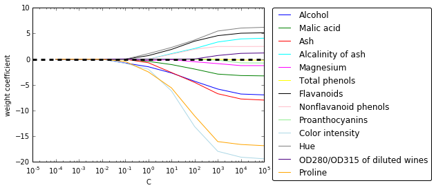


随着 L1 正则项增大，无关特征别排除出模型 (系数变为 0)，因此 L1 正则可以作为特征选择的一种方法

结合 sklearn 的 SelectFromModel 进行选择


```python
from sklearn.feature_selection import SelectFromModel

model_l1 = SelectFromModel(lr, threshold='median', prefit=True)
X_l1_selected = model_l1.transform(X)
```


```python
# 查看选出了哪几个 feature, 黑色是选出来的 
mask = model_l1.get_support()
print(mask)
plt.matshow(mask.reshape(1, -1), cmap='gray_r');
```

    [ True False  True  True False False  True False False  True  True False
      True]


<br>
<br>

### Tree-based feature selection
随机森林算法可以测量各个特征的重要性，因此可以作为特征选择的一种手段

[[back to top](#Sections)]


```python
from sklearn.ensemble import RandomForestClassifier

feat_labels = df_wine.columns[1:]
 
# 使用 decision tree 或 random forests 不需要 standardization或 normalization
forest = RandomForestClassifier(n_estimators=1000,  
                                random_state=0,
                                n_jobs=-1)
forest.fit(X_train, y_train)

# random forest 比较特殊, 有 feature_importances 这个 attribute
importances = forest.feature_importances_

indices = np.argsort(importances)[::-1]
```


```python
for i, idx in enumerate(indices):
    print("%2d) %-*s %f" % (i + 1, 30, 
                            feat_labels[idx], 
                            importances[idx]))
```

     1) Proline                        0.185412
     2) Flavanoids                     0.169830
     3) Color intensity                0.149659
     4) OD280/OD315 of diluted wines   0.127238
     5) Alcohol                        0.117432
     6) Hue                            0.057148
     7) Total phenols                  0.053042
     8) Magnesium                      0.034654
     9) Malic acid                     0.027965
    10) Proanthocyanins                0.025731
    11) Alcalinity of ash              0.021699
    12) Nonflavanoid phenols           0.017372
    13) Ash                            0.012818


```python
plt.title('Feature Importances')
plt.bar(range(X_train.shape[1]), 
        importances[indices],
        color='lightblue', 
        align='center')

plt.xticks(range(X_train.shape[1]), 
           feat_labels[indices], rotation=90)
plt.xlim([-1, X_train.shape[1]])
plt.tight_layout()
#plt.savefig('./random_forest.png', dpi=300)
```


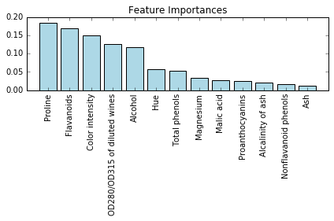


结合 Sklearn 的 SelectFromModel 进行特征选择


```python
from sklearn.feature_selection import SelectFromModel
from sklearn.ensemble import RandomForestClassifier

select_rf = SelectFromModel(forest, threshold=0.1, prefit=True)

# 或者重新训练一个模型
# select = SelectFromModel(RandomForestClassifier(n_estimators=10000, random_state=0, n_jobs=-1), threshold=0.15, prefit=True)
# select.fit(X_train, y_train)

X_train_rf = select_rf.transform(X_train)

print(X_train.shape[1])  # 原始特征维度
print(X_train_rf.shape[1])  # 特征选择后特征维度
```

    13
    5


```python
# 查看选出的特征
mask = select_rf.get_support()
for f in feat_labels[mask]:
    print(f)
```

    Alcohol
    Flavanoids
    Color intensity
    OD280/OD315 of diluted wines
    Proline


```python
# 可视化特征选择结果，黑色的是选中的，白色的是滤过的
mask = select_rf.get_support()
print(mask)
plt.matshow(mask.reshape(1, -1), cmap='gray_r');
```

    [ True False False False False False  True False False  True False  True
      True]


也能将随机森林和 Sequential selection 结合起来


```python
from sklearn.feature_selection import RFE
select = RFE(RandomForestClassifier(n_estimators=100, random_state=0), 
             n_features_to_select=3)

select.fit(X_train, y_train)
# visualize the selected features:
mask = select.get_support()
plt.matshow(mask.reshape(1, -1), cmap='gray_r');
```


<br>
<br>

# Feature extraction
上一节我们学习了 feature selection, 这一节我们要学降维的另一种方法，feature extraction

[[back to top](#Sections)]

## Unsupervised dimensionality reduction via principal component analysis

+ improve computational efficiency
+ help to reduce the **curse of dimensionality**
+ unsupervised linear transformation technique
+ identify patterns in data based on the correlation between features
+ PCA aims to find the directions of maximum variance in high-dimensional data and projects it onto a new subspace with equal or fewer dimensions that the original one.

summarize PCA algorithm:
1. Standardize the d-dimensional dataset.
2. Construct the covariance matrix.
3. Decompose the covariance matrix into its eigenvectors and eigenvalues.
4. Select k eigenvectors that correspond to the k largest eigenvalues, where k is the dimensionality of the new feature subspace ( k ≤ d ).
5. Construct a projection matrix W from the "top" k eigenvectors.
6. Transform the d -dimensional input dataset X using the projection matrix W to obtain the new k -dimensional feature subspace.

简单来说，PCA 是在找寻 variance 最大的方向

[[back to top](#Sections)]

仍然使用 *Wine* dataset


```python
import pandas as pd

df_wine = pd.read_csv('data/wine.data', header=None)

df_wine.columns = ['Class label', 'Alcohol', 'Malic acid', 'Ash', 
'Alcalinity of ash', 'Magnesium', 'Total phenols', 
'Flavanoids', 'Nonflavanoid phenols', 'Proanthocyanins', 
'Color intensity', 'Hue', 'OD280/OD315 of diluted wines', 'Proline']

df_wine.head()
```


<div>
<table border="1" class="dataframe">
  <thead>
    <tr style="text-align: right;">
      <th></th>
      <th>Class label</th>
      <th>Alcohol</th>
      <th>Malic acid</th>
      <th>Ash</th>
      <th>Alcalinity of ash</th>
      <th>Magnesium</th>
      <th>Total phenols</th>
      <th>Flavanoids</th>
      <th>Nonflavanoid phenols</th>
      <th>Proanthocyanins</th>
      <th>Color intensity</th>
      <th>Hue</th>
      <th>OD280/OD315 of diluted wines</th>
      <th>Proline</th>
    </tr>
  </thead>
  <tbody>
    <tr>
      <th>0</th>
      <td>1</td>
      <td>14.23</td>
      <td>1.71</td>
      <td>2.43</td>
      <td>15.6</td>
      <td>127</td>
      <td>2.80</td>
      <td>3.06</td>
      <td>0.28</td>
      <td>2.29</td>
      <td>5.64</td>
      <td>1.04</td>
      <td>3.92</td>
      <td>1065</td>
    </tr>
    <tr>
      <th>1</th>
      <td>1</td>
      <td>13.20</td>
      <td>1.78</td>
      <td>2.14</td>
      <td>11.2</td>
      <td>100</td>
      <td>2.65</td>
      <td>2.76</td>
      <td>0.26</td>
      <td>1.28</td>
      <td>4.38</td>
      <td>1.05</td>
      <td>3.40</td>
      <td>1050</td>
    </tr>
    <tr>
      <th>2</th>
      <td>1</td>
      <td>13.16</td>
      <td>2.36</td>
      <td>2.67</td>
      <td>18.6</td>
      <td>101</td>
      <td>2.80</td>
      <td>3.24</td>
      <td>0.30</td>
      <td>2.81</td>
      <td>5.68</td>
      <td>1.03</td>
      <td>3.17</td>
      <td>1185</td>
    </tr>
    <tr>
      <th>3</th>
      <td>1</td>
      <td>14.37</td>
      <td>1.95</td>
      <td>2.50</td>
      <td>16.8</td>
      <td>113</td>
      <td>3.85</td>
      <td>3.49</td>
      <td>0.24</td>
      <td>2.18</td>
      <td>7.80</td>
      <td>0.86</td>
      <td>3.45</td>
      <td>1480</td>
    </tr>
    <tr>
      <th>4</th>
      <td>1</td>
      <td>13.24</td>
      <td>2.59</td>
      <td>2.87</td>
      <td>21.0</td>
      <td>118</td>
      <td>2.80</td>
      <td>2.69</td>
      <td>0.39</td>
      <td>1.82</td>
      <td>4.32</td>
      <td>1.04</td>
      <td>2.93</td>
      <td>735</td>
    </tr>
  </tbody>
</table>
</div>


Splitting the data into 70% training and 30% test subsets.


```python
from sklearn.cross_validation import train_test_split

X, y = df_wine.iloc[:, 1:].values, df_wine.iloc[:, 0].values

X_train, X_test, y_train, y_test = \
        train_test_split(X, y, test_size=0.3, random_state=0)
```

Standardizing the data.


```python
from sklearn.preprocessing import StandardScaler

sc = StandardScaler()
X_train_std = sc.fit_transform(X_train)
X_test_std = sc.transform(X_test)
```

计算协方差矩阵：
$$ \sigma_{jk}=\frac 1 n \sum^n_{i=1}(x_j^{(i)} - \mu_j)(x_k^{(i)} - \mu_k) $$
通过特征分解得到特征值 $$ \lambda $$ 和特征向量 $$ v $$


```python
import numpy as np
# compute covariance matrix
cov_mat = np.cov(X_train_std.T)

# get eigenvalues and eigenvectors
eigen_vals, eigen_vecs = np.linalg.eig(cov_mat)
# eigen_vecs 13*13
print('Eigenvalues \n %s' % eigen_vals)
```

    Eigenvalues 
     [ 4.8923083   2.46635032  1.42809973  1.01233462  0.84906459  0.60181514
      0.52251546  0.08414846  0.33051429  0.29595018  0.16831254  0.21432212
      0.2399553 ]


<br>
<br>

### Total and explained variance
The variance explained ratio of an eigenvalue is simply the fraction of an eigenvalue and the total sum of the eigenvalues:
$$\frac{\lambda_j}{\sum^d_{i=1}\lambda_i}$$

[[back to top](#Sections)]


```python
tot = sum(eigen_vals)
var_exp = [(i / tot) for i in sorted(eigen_vals, reverse=True)]
cum_var_exp = np.cumsum(var_exp)  # cumulative sum of explained variance
```


```python
# plot variance
import matplotlib.pyplot as plt
%matplotlib inline

plt.bar(range(1, 14), var_exp, alpha=0.5, align='center',
        label='individual explained variance')
plt.step(range(1, 14), cum_var_exp, where='mid',
         label='cumulative explained variance')
plt.ylabel('Explained variance ratio')
plt.xlabel('Principal components')
plt.legend(loc='best')
plt.tight_layout()
# plt.savefig('./figures/pca1.png', dpi=300)
```


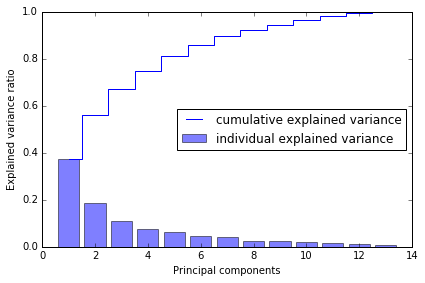


第一个 component 能解释将近 40% 的 variance, 前两个 components 能解释近 60%

<br>
<br>

### Feature transformation

[[back to top](#Sections)]


```python
# Make a list of (eigenvalue, eigenvector) tuples
eigen_pairs = [(np.abs(eigen_vals[i]), eigen_vecs[:,i]) for i in range(len(eigen_vals))]

# Sort the (eigenvalue, eigenvector) tuples from high to low
eigen_pairs.sort(reverse=True)
```

we only chose two eigenvectors for the purpose of illustration, since we are going to plot the data via a two-dimensional scatter plot later in this subsection.

In practice, the number of principal components has to be determined from a trade-off between computational efficiency and the performance of the classifier.


```python
w = np.column_stack([eigen_pairs[0][1], eigen_pairs[1][1]])
print(w)  # 13*2 projection matrix from the top two eigenvectors
```

    [[ 0.14669811 -0.50417079]
     [-0.24224554 -0.24216889]
     [-0.02993442 -0.28698484]
     [-0.25519002  0.06468718]
     [ 0.12079772 -0.22995385]
     [ 0.38934455 -0.09363991]
     [ 0.42326486 -0.01088622]
     [-0.30634956 -0.01870216]
     [ 0.30572219 -0.03040352]
     [-0.09869191 -0.54527081]
     [ 0.30032535  0.27924322]
     [ 0.36821154  0.174365  ]
     [ 0.29259713 -0.36315461]]


利用 projection matrix $$W$$, 我们可以得到转换后的数据 $$x^\prime$$
$$x^\prime = xW$$


```python
# transform the entire 124×13-dimensional training dataset onto the two principal components
X_train_pca = X_train_std.dot(w)
colors = ['r', 'b', 'g']
markers = ['s', 'x', 'o']

for l, c, m in zip(np.unique(y_train), colors, markers):
    plt.scatter(X_train_pca[y_train==l, 0], 
                X_train_pca[y_train==l, 1], 
                c=c, label=l, marker=m)

plt.xlabel('PC 1')
plt.ylabel('PC 2')
plt.legend(loc='lower left')
plt.tight_layout()
# plt.savefig('./figures/pca2.png', dpi=300)
```


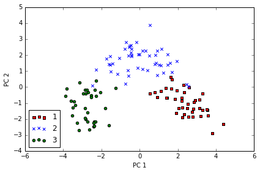


data is more spread along the x-axis, a linear classier will likely be able to separate the classes well

<br>
<br>

### Principal component analysis in scikit-learn

[[back to top](#Sections)]


```python
from sklearn.decomposition import PCA

pca = PCA()
X_train_pca = pca.fit_transform(X_train_std)
pca.explained_variance_ratio_
```


    array([ 0.37329648,  0.18818926,  0.10896791,  0.07724389,  0.06478595,
            0.04592014,  0.03986936,  0.02521914,  0.02258181,  0.01830924,
            0.01635336,  0.01284271,  0.00642076])


```python
plt.bar(range(1, 14), pca.explained_variance_ratio_, alpha=0.5, align='center')
plt.step(range(1, 14), np.cumsum(pca.explained_variance_ratio_), where='mid')
plt.ylabel('Explained variance ratio')
plt.xlabel('Principal components');
```


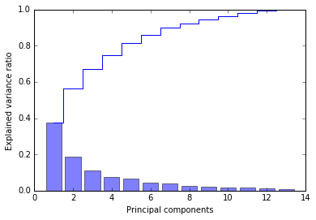


```python
pca = PCA(n_components=2)
X_train_pca = pca.fit_transform(X_train_std)
X_test_pca = pca.transform(X_test_std)
```


```python
plt.scatter(X_train_pca[:,0], X_train_pca[:,1])
plt.xlabel('PC 1')
plt.ylabel('PC 2');
```


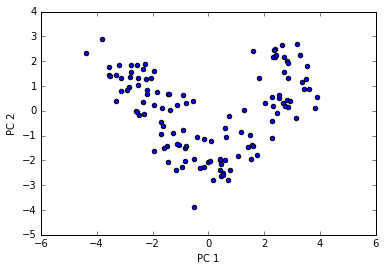


If we compare the PCA projection via scikit-learn with our own PCA implementation, we notice that the plot above is a mirror image of the previous PCA via our step-by-step approach.   
Note that this is not due to an error in any of those two implementations, but the reason for this difference is that, depending on the eigensolver, eigenvectors can have either negative or positive signs.


```python
from matplotlib.colors import ListedColormap

def plot_decision_regions(X, y, classifier, resolution=0.02):

    # setup marker generator and color map
    markers = ('s', 'x', 'o', '^', 'v')
    colors = ('red', 'blue', 'lightgreen', 'gray', 'cyan')
    cmap = ListedColormap(colors[:len(np.unique(y))])

    # plot the decision surface
    x1_min, x1_max = X[:, 0].min() - 1, X[:, 0].max() + 1
    x2_min, x2_max = X[:, 1].min() - 1, X[:, 1].max() + 1
    xx1, xx2 = np.meshgrid(np.arange(x1_min, x1_max, resolution),
                         np.arange(x2_min, x2_max, resolution))
    Z = classifier.predict(np.array([xx1.ravel(), xx2.ravel()]).T)
    Z = Z.reshape(xx1.shape)
    plt.contourf(xx1, xx2, Z, alpha=0.4, cmap=cmap)
    plt.xlim(xx1.min(), xx1.max())
    plt.ylim(xx2.min(), xx2.max())

    # plot class samples
    for idx, cl in enumerate(np.unique(y)):
        plt.scatter(x=X[y == cl, 0], y=X[y == cl, 1],
                    alpha=0.8, c=cmap(idx),
                    marker=markers[idx], label=cl)
```

Training logistic regression classifier using the first 2 principal components.


```python
from sklearn.linear_model import LogisticRegression

lr = LogisticRegression()
lr = lr.fit(X_train_pca, y_train)
```


```python
plot_decision_regions(X_train_pca, y_train, classifier=lr)
plt.xlabel('PC 1')
plt.ylabel('PC 2')
plt.legend(loc='lower left')
plt.tight_layout();
# plt.savefig('./figures/pca3.png', dpi=300)
```


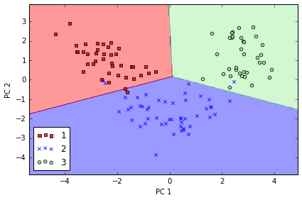


```python
# 在测试集上测试
plot_decision_regions(X_test_pca, y_test, classifier=lr)
plt.xlabel('PC1')
plt.ylabel('PC2')
plt.legend(loc='lower left');
# 分类效果也很不错
```


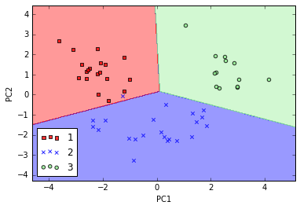


<br>
<br>

<br>
<br>

# Using kernel principal component analysis for nonlinear mappings

via kernel PCA, we perform a nonlinear mapping that transforms the data onto a higher-dimensional space and use standard PCA in this higher-dimensional space to project the data back onto a lower-dimensional space where the samples can be separated by a linear classifier

[[back to top](#Sections)]

most commonly used kernel:
+ polynomial kernel
+ hyperbolic  tangent (sigmoid) kernel
+ Radial Basis Function (RBF)

to implement RBF kernel PCA:
1.  compute the kernel (similarity) matrix k
2. center the kernel matrix k 
3. collect the top k eigenvectors of the centered kernel matrix based on their corresponding eigenvalues, ranked by decreasing magnitude.

<br>
<br>

## Implementing a kernel principal component analysis in Python

[[back to top](#Sections)]

Radial Basis Function (RBF) or Gaussian kernel:
\begin{align}
k(x^{(i)}, x^{(j)}) =& exp(-\frac{||x^{(i)} - x^{(j)}||^2}{2\sigma^2}) \\
                    =& exp(-\gamma ||x^{(i)} - x^{(j)}||^2)
\end{align}


```python
from scipy.spatial.distance import pdist, squareform
from scipy import exp
from scipy.linalg import eigh
import numpy as np

def rbf_kernel_pca(X, gamma, n_components):
    """
    RBF kernel PCA implementation.

    Parameters
    ------------
    X: {NumPy ndarray}, shape = [n_samples, n_features]
        
    gamma: float
      Tuning parameter of the RBF kernel
        
    n_components: int
      Number of principal components to return

    Returns
    ------------
     X_pc: {NumPy ndarray}, shape = [n_samples, k_features]
       Projected dataset   

    """
    # Calculate pairwise squared Euclidean distances
    # in the MxN dimensional dataset.
    sq_dists = pdist(X, 'sqeuclidean')

    # Convert pairwise distances into a square matrix.
    mat_sq_dists = squareform(sq_dists)

    # Compute the symmetric kernel matrix.
    K = exp(-gamma * mat_sq_dists)

    # Center the kernel matrix.
    N = K.shape[0]
    one_n = np.ones((N,N)) / N
    K = K - one_n.dot(K) - K.dot(one_n) + one_n.dot(K).dot(one_n)

    # Obtaining eigenpairs from the centered kernel matrix
    # numpy.eigh returns them in sorted order
    eigvals, eigvecs = eigh(K)

    # Collect the top k eigenvectors (projected samples)
    X_pc = np.column_stack((eigvecs[:, -i]
                            for i in range(1, n_components + 1)))

    return X_pc
```

### Example 1: Separating half-moon shapes

[[back to top](#Sections)]

建造月形数据，用以演示


```python
import matplotlib.pyplot as plt
%matplotlib inline
from sklearn.datasets import make_moons

X, y = make_moons(n_samples=100, random_state=123)

plt.scatter(X[y==0, 0], X[y==0, 1], color='red', marker='^', alpha=0.5)
plt.scatter(X[y==1, 0], X[y==1, 1], color='blue', marker='o', alpha=0.5)

plt.tight_layout()
# plt.savefig('./figures/half_moon_1.png', dpi=300)
```


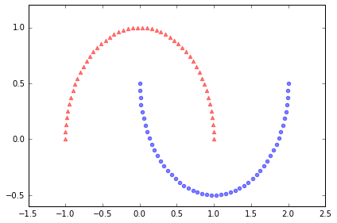


```python
# standardize PCA
from sklearn.decomposition import PCA
from sklearn.preprocessing import StandardScaler

scaler = StandardScaler()
X_std = scaler.fit_transform(X)

scikit_pca = PCA(n_components=2)
X_spca = scikit_pca.fit_transform(X_std)

fig, ax = plt.subplots(nrows=1,ncols=2, figsize=(7,3))

ax[0].scatter(X_spca[y==0, 0], X_spca[y==0, 1], 
            color='red', marker='^', alpha=0.5)
ax[0].scatter(X_spca[y==1, 0], X_spca[y==1, 1],
            color='blue', marker='o', alpha=0.5)

ax[1].scatter(X_spca[y==0, 0], np.zeros((50,1)), 
            color='red', marker='^', alpha=0.5)
ax[1].scatter(X_spca[y==1, 0], np.zeros((50,1)),
            color='blue', marker='o', alpha=0.5)

ax[0].set_xlabel('PC1')
ax[0].set_ylabel('PC2')
ax[1].set_ylim([-1, 1])
ax[1].set_yticks([])
ax[1].set_xlabel('PC1')

plt.tight_layout()
# plt.savefig('./figures/half_moon_2.png', dpi=300)
```


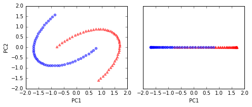


a linear classier would not be able to perform well


```python
# kernel PCA function rbf_kernel_pca
from matplotlib.ticker import FormatStrFormatter

X_kpca = rbf_kernel_pca(X, gamma=15, n_components=2)

fig, ax = plt.subplots(nrows=1,ncols=2, figsize=(7,3))
ax[0].scatter(X_kpca[y==0, 0], X_kpca[y==0, 1], 
            color='red', marker='^', alpha=0.5)
ax[0].scatter(X_kpca[y==1, 0], X_kpca[y==1, 1],
            color='blue', marker='o', alpha=0.5)

ax[1].scatter(X_kpca[y==0, 0], np.zeros((50,1)), 
            color='red', marker='^', alpha=0.5)
ax[1].scatter(X_kpca[y==1, 0], np.zeros((50,1)),
            color='blue', marker='o', alpha=0.5)

ax[0].set_xlabel('PC1')
ax[0].set_ylabel('PC2')
ax[1].set_ylim([-1, 1])
ax[1].set_yticks([])
ax[1].set_xlabel('PC1')
ax[0].xaxis.set_major_formatter(FormatStrFormatter('%0.1f'))
ax[1].xaxis.set_major_formatter(FormatStrFormatter('%0.1f'))

plt.tight_layout()
# plt.savefig('./figures/half_moon_3.png', dpi=300)
```


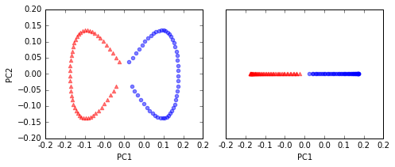


two classes (circles and triangles) are linearly well separated

### Example 2: Separating concentric circles

[[back to top](#Sections)]


```python
from sklearn.datasets import make_circles

X, y = make_circles(n_samples=1000, random_state=123, noise=0.1, factor=0.2)

plt.scatter(X[y==0, 0], X[y==0, 1], color='red', marker='^', alpha=0.5)
plt.scatter(X[y==1, 0], X[y==1, 1], color='blue', marker='o', alpha=0.5)

plt.tight_layout()
# plt.savefig('./figures/circles_1.png', dpi=300)
```


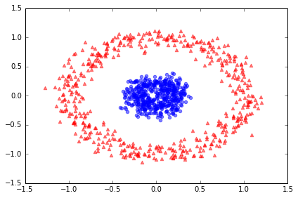


```python
# standard PCA
scaler = StandardScaler()
X_std = scaler.fit_transform(X)

scikit_pca = PCA(n_components=2)
X_spca = scikit_pca.fit_transform(X_std)

fig, ax = plt.subplots(nrows=1,ncols=2, figsize=(7,3))

ax[0].scatter(X_spca[y==0, 0], X_spca[y==0, 1], 
            color='red', marker='^', alpha=0.5)
ax[0].scatter(X_spca[y==1, 0], X_spca[y==1, 1],
            color='blue', marker='o', alpha=0.5)

ax[1].scatter(X_spca[y==0, 0], np.zeros((500,1)), 
            color='red', marker='^', alpha=0.5)
ax[1].scatter(X_spca[y==1, 0], np.zeros((500,1)),
            color='blue', marker='o', alpha=0.5)

ax[0].set_xlabel('PC1')
ax[0].set_ylabel('PC2')
ax[1].set_ylim([-1, 1])
ax[1].set_yticks([])
ax[1].set_xlabel('PC1')

plt.tight_layout()
# plt.savefig('./figures/circles_2.png', dpi=300)
```


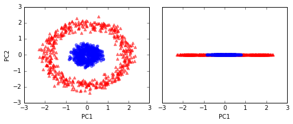


```python
# kernel RBF
X_kpca = rbf_kernel_pca(X, gamma=15, n_components=2)

fig, ax = plt.subplots(nrows=1,ncols=2, figsize=(7,3))
ax[0].scatter(X_kpca[y==0, 0], X_kpca[y==0, 1], 
            color='red', marker='^', alpha=0.5)
ax[0].scatter(X_kpca[y==1, 0], X_kpca[y==1, 1],
            color='blue', marker='o', alpha=0.5)

ax[1].scatter(X_kpca[y==0, 0], np.zeros((500,1)), 
            color='red', marker='^', alpha=0.5)
ax[1].scatter(X_kpca[y==1, 0], np.zeros((500,1)),
            color='blue', marker='o', alpha=0.5)

ax[0].set_xlabel('PC1')
ax[0].set_ylabel('PC2')
ax[1].set_ylim([-1, 1])
ax[1].set_yticks([])
ax[1].set_xlabel('PC1')

plt.tight_layout()
# plt.savefig('./figures/circles_3.png', dpi=300)
```


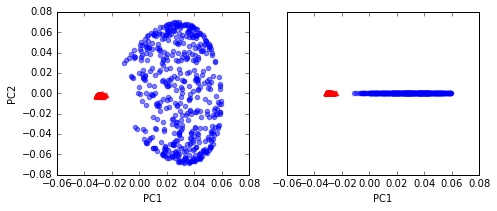


<br>
<br>

## Projecting new data points
learn how to project data points that were not part of the training dataset

[[back to top](#Sections)]


```python
from scipy.spatial.distance import pdist, squareform
from scipy import exp
from scipy.linalg import eigh
import numpy as np

def rbf_kernel_pca(X, gamma, n_components):
    """
    RBF kernel PCA implementation.

    Parameters
    ------------
    X: {NumPy ndarray}, shape = [n_samples, n_features]
        
    gamma: float
      Tuning parameter of the RBF kernel
        
    n_components: int
      Number of principal components to return

    Returns
    ------------
     X_pc: {NumPy ndarray}, shape = [n_samples, k_features]
       Projected dataset   
     
     lambdas: list
       Eigenvalues

    """
    # Calculate pairwise squared Euclidean distances
    # in the MxN dimensional dataset.
    sq_dists = pdist(X, 'sqeuclidean')

    # Convert pairwise distances into a square matrix.
    mat_sq_dists = squareform(sq_dists)

    # Compute the symmetric kernel matrix.
    K = exp(-gamma * mat_sq_dists)

    # Center the kernel matrix.
    N = K.shape[0]
    one_n = np.ones((N,N)) / N
    K = K - one_n.dot(K) - K.dot(one_n) + one_n.dot(K).dot(one_n)

    # Obtaining eigenpairs from the centered kernel matrix
    # numpy.eigh returns them in sorted order
    eigvals, eigvecs = eigh(K)

    # Collect the top k eigenvectors (projected samples)
    alphas = np.column_stack((eigvecs[:,-i] for i in range(1,n_components+1)))
    
    # Collect the corresponding eigenvalues
    lambdas = [eigvals[-i] for i in range(1,n_components+1)]

    return alphas, lambdas
```


```python
X, y = make_moons(n_samples=100, random_state=123)
alphas, lambdas = rbf_kernel_pca(X, gamma=15, n_components=1)
```


```python
x_new = X[25]
x_new
```


    array([ 1.8713,  0.0093])


```python
x_proj = alphas[25] # original projection
x_proj
```


    array([ 0.0788])


```python
def project_x(x_new, X, gamma, alphas, lambdas):
    pair_dist = np.array([np.sum((x_new-row)**2) for row in X])
    k = np.exp(-gamma * pair_dist)
    return k.dot(alphas / lambdas)

# projection of the "new" datapoint
x_reproj = project_x(x_new, X, gamma=15, alphas=alphas, lambdas=lambdas)
x_reproj 
```


    array([ 0.0788])


```python
plt.scatter(alphas[y==0, 0], np.zeros((50)), 
            color='red', marker='^',alpha=0.5)
plt.scatter(alphas[y==1, 0], np.zeros((50)), 
            color='blue', marker='o', alpha=0.5)
plt.scatter(x_proj, 0, color='black', label='original projection of point X[25]', marker='^', s=100)
plt.scatter(x_reproj, 0, color='green', label='remapped point X[25]', marker='x', s=500)
plt.legend(scatterpoints=1)

plt.tight_layout()
# plt.savefig('./figures/reproject.png', dpi=300)
```


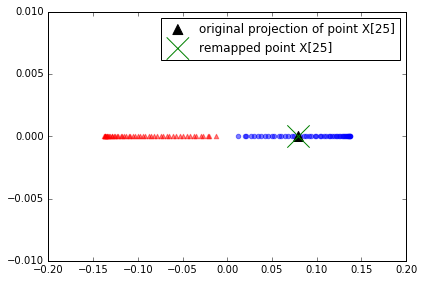


project correctly

<br>
<br>

## Kernel principal component analysis in scikit-learn

[[back to top](#Sections)]


```python
from sklearn.decomposition import KernelPCA

X, y = make_moons(n_samples=100, random_state=123)
scikit_kpca = KernelPCA(n_components=2, kernel='rbf', gamma=15)
X_skernpca = scikit_kpca.fit_transform(X)

plt.scatter(X_skernpca[y==0, 0], X_skernpca[y==0, 1], 
            color='red', marker='^', alpha=0.5)
plt.scatter(X_skernpca[y==1, 0], X_skernpca[y==1, 1], 
            color='blue', marker='o', alpha=0.5)

plt.xlabel('PC1')
plt.ylabel('PC2')
plt.tight_layout()
# plt.savefig('./figures/scikit_kpca.png', dpi=300)
```


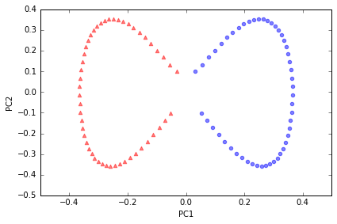


### 特征工程checklist
- Do you have domain knowledge? If yes, construct a better set of ad hoc”” features
- Are your features commensurate? If no, consider normalizing them.
- Do you suspect interdependence of features? If yes, expand your feature set by constructing conjunctive features or products of features, as much as your computer resources allow you.
- Do you need to prune the input variables (e.g. for cost, speed or data understanding reasons)? If no, construct disjunctive features or weighted sums of feature
- Do you need to assess features individually (e.g. to understand their influence on the system or because their number is so large that you need to do a first filtering)? If yes, use a variable ranking method; else, do it anyway to get baseline results.
- Do you need a predictor? If no, stop
- Do you suspect your data is “dirty” (has a few meaningless input patterns and/or noisy outputs or wrong class labels)? If yes, detect the outlier examples using the top ranking variables obtained in step 5 as representation; check and/or discard them.
- Do you know what to try first? If no, use a linear predictor. Use a forward selection method with the “probe” method as a stopping criterion or use the 0-norm embedded method for comparison, following the ranking of step 5, construct a sequence of predictors of same nature using increasing subsets of features. Can you match or improve performance with a smaller subset? If yes, try a non-linear predictor with that subset.
- Do you have new ideas, time, computational resources, and enough examples? If yes, compare several feature selection methods, including your new idea, correlation coefficients, backward selection and embedded methods. Use linear and non-linear predictors. Select the best approach with model selection
- Do you want a stable solution (to improve performance and/or understanding)? If yes, subsample your data and redo your analysis for several “bootstrap”.

<br>
<br>

## 一个使用正则化方法进行变量选择的例子

[[back to top](#Sections)]


```python
from sklearn import datasets
from sklearn import cross_validation
from sklearn import linear_model
from sklearn import metrics
from sklearn import tree
from sklearn import neighbors
from sklearn import svm
from sklearn import ensemble
from sklearn import cluster

import matplotlib.pyplot as plt
%matplotlib inline

import numpy as np
import seaborn as sns
```


```python
np.random.seed(123)
```


```python
# 构建 dataset, 50个 sample, 50个 feature
X_all, y_all = datasets.make_regression(n_samples=50, n_features=50, n_informative=10) 
```


```python
# 50% train, 50% test
X_train, X_test, y_train, y_test = cross_validation.train_test_split(X_all, y_all, train_size=0.5)
```


```python
X_train.shape, y_train.shape
```


    ((25, 50), (25,))


```python
X_test.shape, y_test.shape
```


    ((25, 50), (25,))


<br>
<br>

## Linear Regression

$$ \text{min}_{w, b} \sum_i || w^\mathsf{T}x_i + b  - y_i||^2 $$

[[back to top](#Sections)]


```python
# linear reg
model = linear_model.LinearRegression()
```


```python
model.fit(X_train, y_train)
```

    /Users/alan/anaconda/lib/python2.7/site-packages/scipy/linalg/basic.py:884: RuntimeWarning: internal gelsd driver lwork query error, required iwork dimension not returned. This is likely the result of LAPACK bug 0038, fixed in LAPACK 3.2.2 (released July 21, 2010). Falling back to 'gelss' driver.
      warnings.warn(mesg, RuntimeWarning)


    LinearRegression(copy_X=True, fit_intercept=True, n_jobs=1, normalize=False)


```python
def sse(resid):
    return sum(resid**2)
```


```python
# 计算 train data 的 SSE 
resid_train = y_train - model.predict(X_train)
sse_train = sse(resid_train)
sse_train
```


    7.9634561748974877e-25


```python
# 预测 test 再计算 test data 的SSE
resid_test = y_test - model.predict(X_test)
sse_test = sse(resid_test)
sse_test
```


    213555.61203039085


结果 test data 显示预测效果很差, 可能 overfitting


```python
model.score(X_train, y_train)
```


    1.0


```python
model.score(X_test, y_test)
```


    0.31407400675201724


```python
def plot_residuals_and_coeff(resid_train, resid_test, coeff):
    fig, axes = plt.subplots(1, 3, figsize=(12, 3))
    axes[0].bar(np.arange(len(resid_train)), resid_train)
    axes[0].set_xlabel("sample number")
    axes[0].set_ylabel("residual")
    axes[0].set_title("training data")
    axes[1].bar(np.arange(len(resid_test)), resid_test)
    axes[1].set_xlabel("sample number")
    axes[1].set_ylabel("residual")
    axes[1].set_title("testing data")
    axes[2].bar(np.arange(len(coeff)), coeff)
    axes[2].set_xlabel("coefficient number")
    axes[2].set_ylabel("coefficient")
    fig.tight_layout()
    return fig, axes
```


```python
# 画出 residual
fig, ax = plot_residuals_and_coeff(resid_train, resid_test, model.coef_);
```


<br>
<br>

## Ridge Regression

L2 penalized, add squared sum of the weights to least-squares cost function


$$ \text{min}_{w,b}  \sum_i || w^\mathsf{T}x_i + b  - y_i||^2  + \alpha ||w||_2^2$$ 

[[back to top](#Sections)]


```python
# 使用 Ridge 正则化
model = linear_model.Ridge(alpha=5)
```


```python
model.fit(X_train, y_train)
```


    Ridge(alpha=5, copy_X=True, fit_intercept=True, max_iter=None,
       normalize=False, random_state=None, solver='auto', tol=0.001)


```python
resid_train = y_train - model.predict(X_train)
sse_train = sum(resid_train**2)
sse_train
```


    3292.9620358692705


```python
resid_test = y_test - model.predict(X_test)
sse_test = sum(resid_test**2)
sse_test
```


    209557.58585055024


train data的 SSE 提升很多


```python
# test model score 仍然不高
model.score(X_train, y_train), model.score(X_test, y_test)
```


    (0.99003021243324718, 0.32691539290134652)


```python
fig, ax = plot_residuals_and_coeff(resid_train, resid_test, model.coef_)
```


<br>
<br>

## LASSO Regression

L1-norm certain weights can become zero, useful as a supervised feature selection technique.

$$ \text{min}_{w, b} \sum_i || w^\mathsf{T}x_i + b  - y_i||^2  + \alpha ||w||_1$$ 

[[back to top](#Sections)]


```python
model = linear_model.Lasso(alpha=1.0)
```


```python
model.fit(X_train, y_train)
```


    Lasso(alpha=1.0, copy_X=True, fit_intercept=True, max_iter=1000,
       normalize=False, positive=False, precompute=False, random_state=None,
       selection='cyclic', tol=0.0001, warm_start=False)


```python
resid_train = y_train - model.predict(X_train)
sse_train = sse(resid_train)
sse_train
```


    309.74971389532328


```python
resid_test = y_test - model.predict(X_test)
sse_test = sse(resid_test)
sse_test
```


    1489.117606500263


相较 Ridge, SSE 都减少很多


```python
fig, ax = plot_residuals_and_coeff(resid_train, resid_test, model.coef_)
```


上图发现, coeff 有很多都是0


```python
alphas = np.logspace(-4, 2, 100)
```


```python
# 寻找 LASSO 的最优参数 alpha 
coeffs = np.zeros((len(alphas), X_train.shape[1]))
sse_train = np.zeros_like(alphas)
sse_test = np.zeros_like(alphas)

for n, alpha in enumerate(alphas):
    model = linear_model.Lasso(alpha=alpha)
    model.fit(X_train, y_train)
    coeffs[n, :] = model.coef_
    resid = y_train - model.predict(X_train)
    sse_train[n] = sum(resid**2)
    resid = y_test - model.predict(X_test)
    sse_test[n] = sum(resid**2)
```

    /Users/alan/anaconda/lib/python2.7/site-packages/sklearn/linear_model/coordinate_descent.py:466: ConvergenceWarning: Objective did not converge. You might want to increase the number of iterations
      ConvergenceWarning)


```python
fig, axes = plt.subplots(1, 2, figsize=(12, 4), sharex=True)

for n in range(coeffs.shape[1]):
    axes[0].plot(np.log10(alphas), coeffs[:, n], color='k', lw=0.5)

axes[1].semilogy(np.log10(alphas), sse_train, label="train")
axes[1].semilogy(np.log10(alphas), sse_test, label="test")
axes[1].legend(loc=0)

axes[0].set_xlabel(r"${\log_{10}}\alpha$", fontsize=18)
axes[0].set_ylabel(r"coefficients", fontsize=18)
axes[1].set_xlabel(r"${\log_{10}}\alpha$", fontsize=18)
axes[1].set_ylabel(r"sse", fontsize=18)
fig.tight_layout()
```


alpha 越大, coeff 最终都会变成0, 而 train SSE 会先减小再增加, 而 test 是一直在增加. 

在-1附近, train SSE 最小, 而 coeff 大概有8个不是0.


```python
# 使用LassoCV: Lasso linear model with iterative fitting along a regularization path
model = linear_model.LassoCV()
```


```python
model.fit(X_all, y_all)
```


    LassoCV(alphas=None, copy_X=True, cv=None, eps=0.001, fit_intercept=True,
        max_iter=1000, n_alphas=100, n_jobs=1, normalize=False, positive=False,
        precompute='auto', random_state=None, selection='cyclic', tol=0.0001,
        verbose=False)


```python
# 计算出的最佳 alphs
model.alpha_
```


    0.06559238747534718


```python
resid_train = y_train - model.predict(X_train)
sse_train = sse(resid_train)
sse_train
```


    1.5450589323148352


```python
resid_test = y_test - model.predict(X_test)
sse_test = sse(resid_test)
sse_test
```


    1.5321417406216176


发现 SSE 都已经比较接近0了


```python
model.score(X_train, y_train), model.score(X_test, y_test)
# score 都很高
```


    (0.99999532217220677, 0.99999507886570982)


```python
fig, ax = plot_residuals_and_coeff(resid_train, resid_test, model.coef_)
# 9个 non-zero coeff
```


```python

```

## 练习：利用本章学到的方法对信贷数据进行特征工程

<br>
<br>
