# 第6章：非监督学习方法

## Sections

- [Some notable clustering routines](#some-notable-clustering-routines)
- [Grouping objects by similarity using k-means](#grouping-objects-by-similarity-using-k-means)
    - [k-means in Sklearn](#k-means-in-sklearn)
    - [k-means++](#k-means)
    - [Implementing k-means in Python](#implementing-k-means-in-python)
    - [Using the elbow method to find the optimal number of clusters](#using-the-elbow-method-to-find-the-optimal-number-of-clusters)
    - [Quantifying the quality of clustering via silhouette plots](#quantifying-the-quality-of-clustering-via-silhouette-plots)
- [Organizing clusters as a hierarchical tree](#organizing-clusters-as-a-hierarchical-tree)
    - [Performing hierarchical clustering on a distance matrix](#performing-hierarchical-clustering-on-a-distance-matrix)
    - [Attaching dendrograms to a heat map](#attaching-dendrograms-to-a-heat-map)
    - [Applying agglomerative clustering via scikit-learn](#applying-agglomerative-clustering-via-scikit-learn)
    - [Applying agglomerative clustering with iris dataset](#applying-agglomerative-clustering-with-iris-dataset)
- [Locating regions of high density via DBSCAN](#locating-regions-of-high-density-via-dbscan)
- [Learning from labeled and unlabeled data with label propagation](#learning-from-labeled-and-unlabeled-data-with-label-propagation)

Clustering is the task of gathering samples into groups of similar
samples according to some predefined similarity or distance (dissimilarity)
measure, such as the Euclidean distance.

Here are some common applications of clustering algorithms:

- Compression for data reduction
- Summarizing data as a reprocessing step for recommender systems
- Similarly:
   - grouping related web news (e.g. Google News) and web search results
   - grouping related stock quotes for investment portfolio management
   - building customer profiles for market analysis
- Building a code book of prototype samples for unsupervised feature extraction

<br>
<br>

# Some notable clustering routines

[[back to top](#sections)]

The following are two well-known clustering algorithms. 

- `sklearn.cluster.KMeans`: <br/>
    The simplest, yet effective clustering algorithm. Needs to be provided with the
    number of clusters in advance, and assumes that the data is normalized as input
    (but use a PCA model as preprocessor).
- `sklearn.cluster.MeanShift`: <br/>
    Can find better looking clusters than KMeans but is not scalable to high number of samples.
- `sklearn.cluster.DBSCAN`: <br/>
    Can detect irregularly shaped clusters based on density, i.e. sparse regions in
    the input space are likely to become inter-cluster boundaries. Can also detect
    outliers (samples that are not part of a cluster).
- `sklearn.cluster.AffinityPropagation`: <br/>
    Clustering algorithm based on message passing between data points.
- `sklearn.cluster.SpectralClustering`: <br/>
    KMeans applied to a projection of the normalized graph Laplacian: finds
    normalized graph cuts if the affinity matrix is interpreted as an adjacency matrix of a graph.
- `sklearn.cluster.Ward`: <br/>
    Ward implements hierarchical clustering based on the Ward algorithm,
    a variance-minimizing approach. At each step, it minimizes the sum of
    squared differences within all clusters (inertia criterion).

Of these, Ward, SpectralClustering, DBSCAN and Affinity propagation can also work with precomputed similarity matrices.


<br>
<br>

# Grouping objects by similarity using k-means

[[back to top](#sections)]


```python
# make dataset
from sklearn.datasets import make_blobs
X, y = make_blobs(n_samples=150, 
                  n_features=2, 
                  centers=3, # 从三类中抽取
                  cluster_std=0.5, 
                  shuffle=True, 
                  random_state=0)
```


```python
# 画个图看看
import matplotlib.pyplot as plt
%matplotlib inline
plt.scatter(X[:,0], X[:,1],  c='white', marker='o', s=50)
plt.grid()
plt.tight_layout()
#plt.savefig('./figures/spheres.png', dpi=300)
```


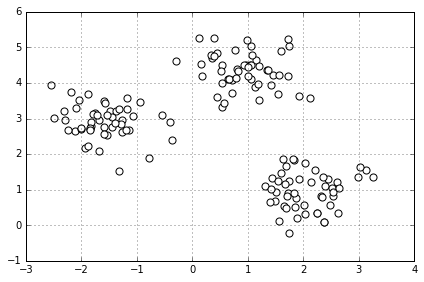


## k-means 算法

1. Randomly pick `k` centroids from the sample points as initial cluster centers.
2. Assign each sample to the nearest centroid $$\mu^{(j)}, j∈\{1,...,k\}$$.
3. Move the centroids to the center of the samples that were assigned to it.
4. Repeat the steps 2 and 3 until the cluster assignment do not change or a user-defined tolerance or a maximum number of iterations is reached.

[Visualizing K-Means Clustering](http://www.naftaliharris.com/blog/visualizing-k-means-clustering/)

如何来测量两个物体之间的相似度, similarity  
或者如何表示两个物体之间的距离, distance

最常见的一种距离度量是 squared Euclidean distance: 
$$ d(x,y)^2 = \sum_{j=1}^{m} (x_j -y_j)^2 = \lVert x - y \rVert_2^2 $$

k-means 可转化为最优化的问题, 最小化 within-cluster sum of squared errors (SSE), 又称为 cluster inertia
$$ SSE = \sum_{i=1}^n\sum_{j=1}^k w^{(i,j)}\lVert x^{(i)}-\mu^{(j)}\rVert_2^2 $$
其中 $$\mu^{(j)}$$ 是第 j 个聚类的中心，如果样本 i 在聚类 j 中，$$w^{(i,j)}=1$$，否则 $$w^{(i,j)}=0$$

<br>

## k-means in Sklearn

[[back to top](#sections)]


```python
# 使用 sklearn 中 KMeans 来聚类
from sklearn.cluster import KMeans
km = KMeans(n_clusters=3,  # k 是需要自己设定的, 错误的 k 可能结果就不对
            init='random',
            n_init=10,  # 重复运行算法 10 次，选其中最好的聚类模型，避免不好的初始化值带来的影响
            max_iter=300,
            tol=1e-04,
            random_state=0)

y_km = km.fit_predict(X)
```


```python
plt.scatter(X[y_km==0,0], 
            X[y_km==0,1], 
            s=50, 
            c='lightgreen', 
            marker='s', 
            label='cluster 1')
plt.scatter(X[y_km==1,0], 
            X[y_km==1,1], 
            s=50, 
            c='orange', 
            marker='o', 
            label='cluster 2')
plt.scatter(X[y_km==2,0], 
            X[y_km==2,1], 
            s=50, 
            c='lightblue', 
            marker='v', 
            label='cluster 3')
plt.scatter(km.cluster_centers_[:,0], 
            km.cluster_centers_[:,1], 
            s=250, 
            marker='*', 
            c='red', 
            label='centroids')
plt.legend()
plt.grid()
plt.tight_layout()
#plt.savefig('./figures/centroids.png', dpi=300)
```


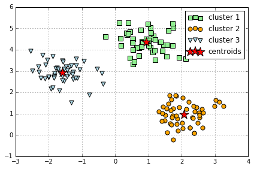


<br>

## k-means++

[[back to top](#sections)]

k-means++ 算法通过改善 centroids 初始值的设置，来优化 k-means

1. Initialize an empty set $$M$$ to store the k centroids being selected
2. Randomly choose the first centroid $$\mu^{(j)}$$ from the input samples and assign it to $$M$$
3. For each sample $$x^{(i)}$$ that is not in M, find the minimum squared distance $$d(x^{(i)}, M)^2$$ to any of the centroids in M
4. To randomly select the next centroid $$\mu^{(p)}$$, use a weighted probability distribution equal to $$\frac{d(\mu^{(p)}, M)^2}{\sum_i d(x^{(i)}, M)^2}$$
5. Repeat steps 2 and 3 until $$k$$ centroids are chosen
6. Proceed with the classic k-means algorithm

sklearn 里使用 k-means++ 算法只需在 KMeans() 里设置 init="k-means++"


```python
# 对比 k-means 和 k-means++
import numpy as np
from sklearn.utils import shuffle
from sklearn.utils import check_random_state
from sklearn.cluster import KMeans

random_state = np.random.RandomState(0)

# Number of run (with randomly generated dataset) for each strategy so as
# to be able to compute an estimate of the standard deviation
n_runs = 5

# k-means models can do several random inits so as to be able to trade
# CPU time for convergence robustness
n_init_range = np.array([1, 5, 10, 15, 20])

# Datasets generation parameters
n_samples_per_center = 100
grid_size = 3
scale = 0.1
n_clusters = grid_size ** 2


def make_data(random_state, n_samples_per_center, grid_size, scale):
    random_state = check_random_state(random_state)
    centers = np.array([[i, j]
                        for i in range(grid_size)
                        for j in range(grid_size)])
    n_clusters_true, n_features = centers.shape

    noise = random_state.normal(
        scale=scale, size=(n_samples_per_center, centers.shape[1]))

    X = np.concatenate([c + noise for c in centers])
    y = np.concatenate([[i] * n_samples_per_center
                        for i in range(n_clusters_true)])
    return shuffle(X, y, random_state=random_state)


fig = plt.figure()
plots = []
legends = []

cases = [
    (KMeans, 'k-means++'),
    (KMeans, 'random')
]

for factory, init in cases:
    print("Evaluation of %s with %s init" % (factory.__name__, init))
    inertia = np.empty((len(n_init_range), n_runs))

    for run_id in range(n_runs):
        X_data, y = make_data(run_id, n_samples_per_center, grid_size, scale)
        for i, n_init in enumerate(n_init_range):
            kmean = factory(n_clusters=n_clusters, init=init, random_state=run_id,
                         n_init=n_init).fit(X_data)
            inertia[i, run_id] = kmean.inertia_
    p = plt.errorbar(n_init_range, inertia.mean(axis=1), inertia.std(axis=1))
    plots.append(p[0])
    legends.append("%s with %s init" % (factory.__name__, init))

plt.xlabel('n_init')
plt.ylabel('inertia')
plt.legend(plots, legends)
plt.title("Mean inertia for various k-means init across %d runs" % n_runs);
```

    Evaluation of KMeans with k-means++ init
    Evaluation of KMeans with random init


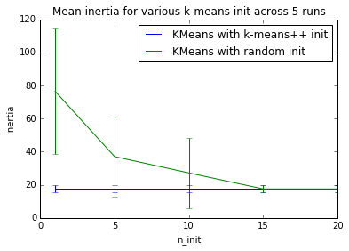


<br>

## Implementing k-means in Python

[[back to top](#sections)]


```python
import numpy as np
from sklearn.metrics import pairwise_distances


def get_initial_centroids(data, k, seed=None):
    '''Randomly choose k data points as initial centroids'''
    if seed is not None: # useful for obtaining consistent results
        np.random.seed(seed)
    n = data.shape[0] # number of data points
        
    # Pick K indices from range [0, N).
    rand_indices = np.random.randint(0, n, k)
    
    # Keep centroids as dense format, as many entries will be nonzero due to averaging.
    # As long as at least one document in a cluster contains a word,
    # it will carry a nonzero weight in the TF-IDF vector of the centroid.
    centroids = data[rand_indices,:]
    
    return centroids


def smart_initialize(data, k, seed=None):
    '''Use k-means++ to initialize a good set of centroids'''
    if seed is not None: # useful for obtaining consistent results
        np.random.seed(seed)
    centroids = np.zeros((k, data.shape[1]))
    
    # Randomly choose the first centroid.
    # Since we have no prior knowledge, choose uniformly at random
    idx = np.random.randint(data.shape[0])
    centroids[0] = data[idx,:]
    # Compute distances from the first centroid chosen to all the other data points
    distances = pairwise_distances(data, centroids[0:1], metric='euclidean').flatten()
    
    for i in xrange(1, k):
        # Choose the next centroid randomly, so that the probability for each data point to be chosen
        # is directly proportional to its squared distance from the nearest centroid.
        # Roughtly speaking, a new centroid should be as far as from ohter centroids as possible.
        idx = np.random.choice(data.shape[0], 1, p=distances/sum(distances))
        centroids[i] = data[idx,:]
        # Now compute distances from the centroids to all data points
        distances = np.min(pairwise_distances(data, centroids[0:i+1], metric='euclidean'),axis=1)
    
    return centroids


def assign_clusters(data, centroids):
    # Compute distances between each data point and the set of centroids:
    distances_from_centroids = pairwise_distances(data, centroids)
    
    # Compute cluster assignments for each data point:
    cluster_assignment = np.argmin(distances_from_centroids, axis=1)
    
    return cluster_assignment


def revise_centroids(data, k, cluster_assignment):
    new_centroids = []
    for i in xrange(k):
        # Select all data points that belong to cluster i. Fill in the blank (RHS only)
        member_data_points = data[cluster_assignment == i]
        # Compute the mean of the data points. Fill in the blank (RHS only)
        centroid = member_data_points.mean(axis=0)
        new_centroids.append(centroid)
    new_centroids = np.array(new_centroids)
    return new_centroids


def kmeans(data, k, init='kmeans++', maxiter=100, seed=None):
    # Initialize centroids
    if init == 'kmeans++':
        centroids = smart_initialize(data, k, seed)
    else:
        centroids = get_initial_centroids(data, k, seed)
    prev_cluster_assignment = None
    
    for itr in xrange(maxiter):                
        # 1. Make cluster assignments using nearest centroids
        cluster_assignment = assign_clusters(data, centroids)
            
        # 2. Compute a new centroid for each of the k clusters, averaging all data points assigned to that cluster.
        centroids = revise_centroids(data, k, cluster_assignment)
            
        # Check for convergence: if none of the assignments changed, stop
        if prev_cluster_assignment is not None and \
          (prev_cluster_assignment==cluster_assignment).all():
            break

        prev_cluster_assignment = cluster_assignment[:]
        
    return centroids, cluster_assignment
```


```python
centers, y_km = kmeans(X, 3, seed=0)
```


```python
plt.scatter(X[y_km==0,0], 
            X[y_km==0,1], 
            s=50, 
            c='lightgreen', 
            marker='s', 
            label='cluster 1')
plt.scatter(X[y_km==1,0], 
            X[y_km==1,1], 
            s=50, 
            c='orange', 
            marker='o', 
            label='cluster 2')
plt.scatter(X[y_km==2,0], 
            X[y_km==2,1], 
            s=50, 
            c='lightblue', 
            marker='v', 
            label='cluster 3')
plt.scatter(centers[:,0], 
            centers[:,1], 
            s=250, 
            marker='*', 
            c='red', 
            label='centroids')
plt.legend()
plt.grid()
plt.tight_layout()
#plt.savefig('./figures/centroids.png', dpi=300)
```


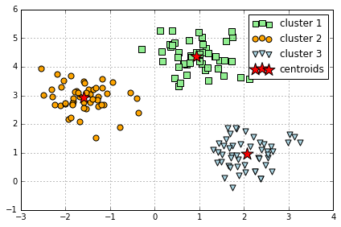


<br>

### Using the elbow method to find the optimal number of clusters 

通常我们并不知道数据能分成几个聚类，所以能有办法选择合适 k 值非常重要

[[back to top](#sections)]

判断聚类效果可用 within-cluster SSE (Distortion)，这个可由 KMeans() 中的 inertia_ 属性获得


```python
print('Distortion: %.2f' % km.inertia_)
```

    Distortion: 72.48


The Elbow method is a "rule-of-thumb" approach to finding the optimal number of clusters.


```python
# elbow method 方法就是需要找出当 distortion 变化非常快时的 k 值，也即找拐点
distortions = []
for i in range(1, 11):
    km = KMeans(n_clusters=i, 
                init='k-means++', 
                n_init=10, 
                max_iter=300, 
                random_state=0)
    km.fit(X)
    distortions.append(km.inertia_)
plt.plot(range(1,11), distortions , marker='o')
plt.xlabel('Number of clusters')
plt.ylabel('Distortion')
plt.tight_layout()
#plt.savefig('./figures/elbow.png', dpi=300)
```


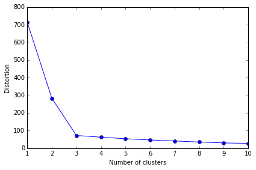


从图中就可以看出, 3 是拐点, 所以 k=3 是最好的选择

<br>

## Quantifying the quality of clustering via silhouette plots

[[back to top](#sections)]

另一种评价聚类效果的方法是 silhouette analysis, 衡量的是一个类别中的样本是否足够紧凑组合

计算 $$x^{(i)}$$ 的 silhouette coefficient 的步骤为:
1. Calculate the cluster cohesion $$a^{(i)}$$ as the average distance between a sample $$x^{(i)}$$ and all other points in the same cluster.
2. Calculate the cluster separation $$b^{(i)}$$ from the next closest cluster as the average distance between the sample $$x^{(i)}$$ and all samples in the nearest cluster.
3. Calculate the silhouette $$s^{(i)}$$ as the difference between cluster cohesion and separation divided by the greater of the two, as shown here:
$$ s^{(i)} = \frac{b^{(i)} - a^{(i)}}{max\big\{b^{(i)}, a^{(i)}\big\}} $$


```python
import numpy as np
from matplotlib import cm
from sklearn.metrics import silhouette_samples  # silhouette coefficient

km = KMeans(n_clusters=3, 
            init='k-means++', 
            n_init=10, 
            max_iter=300,
            tol=1e-04,
            random_state=0)
y_km = km.fit_predict(X)

cluster_labels = np.unique(y_km)
n_clusters = cluster_labels.shape[0]
silhouette_vals = silhouette_samples(X, y_km, metric='euclidean')
y_ax_lower, y_ax_upper = 0, 0
yticks = []
for i, c in enumerate(cluster_labels):
    c_silhouette_vals = silhouette_vals[y_km == c]
    c_silhouette_vals.sort()
    y_ax_upper += len(c_silhouette_vals)
    color = cm.jet(i / float(n_clusters))
    plt.barh(range(y_ax_lower, y_ax_upper), c_silhouette_vals, height=1.0, 
            edgecolor='none', color=color)

    yticks.append((y_ax_lower + y_ax_upper) / 2)
    y_ax_lower += len(c_silhouette_vals)
    
silhouette_avg = np.mean(silhouette_vals)
plt.axvline(silhouette_avg, color="red", linestyle="--") 

plt.yticks(yticks, cluster_labels + 1)
plt.ylabel('Cluster')
plt.xlabel('Silhouette coefficient')

plt.tight_layout()
# plt.savefig('./figures/silhouette.png', dpi=300)
```


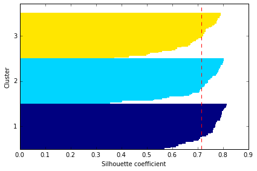


红线表示所有数据 silhouette coef 的平均值，它可作为聚类模型的一个度量指标

Comparison to "bad" clustering:


```python
km = KMeans(n_clusters=2, # 设定为2
            init='k-means++', 
            n_init=10, 
            max_iter=300,
            tol=1e-04,
            random_state=0)
y_km = km.fit_predict(X)

plt.scatter(X[y_km==0,0], 
            X[y_km==0,1], 
            s=50, 
            c='lightgreen', 
            marker='s', 
            label='cluster 1')
plt.scatter(X[y_km==1,0], 
            X[y_km==1,1], 
            s=50, 
            c='orange', 
            marker='o', 
            label='cluster 2')

plt.scatter(km.cluster_centers_[:,0], km.cluster_centers_[:,1], s=250, marker='*', c='red', label='centroids')
plt.legend()
plt.grid()
plt.tight_layout()
#plt.savefig('./figures/centroids_bad.png', dpi=300)
```


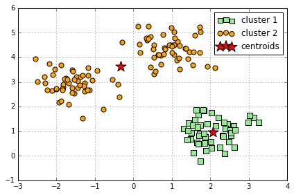


```python
# evaluate the results
cluster_labels = np.unique(y_km)
n_clusters = cluster_labels.shape[0]
silhouette_vals = silhouette_samples(X, y_km, metric='euclidean')
y_ax_lower, y_ax_upper = 0, 0
yticks = []
for i, c in enumerate(cluster_labels):
    c_silhouette_vals = silhouette_vals[y_km == c]
    c_silhouette_vals.sort()
    y_ax_upper += len(c_silhouette_vals)
    color = cm.jet(i / float(n_clusters))
    plt.barh(range(y_ax_lower, y_ax_upper), c_silhouette_vals, height=1.0, 
            edgecolor='none', color=color)

    yticks.append((y_ax_lower + y_ax_upper) / 2)
    y_ax_lower += len(c_silhouette_vals)
    
silhouette_avg = np.mean(silhouette_vals)
plt.axvline(silhouette_avg, color="red", linestyle="--") 

plt.yticks(yticks, cluster_labels + 1)
plt.ylabel('Cluster')
plt.xlabel('Silhouette coefficient')

plt.tight_layout()
# plt.savefig('./figures/silhouette_bad.png', dpi=300)
```


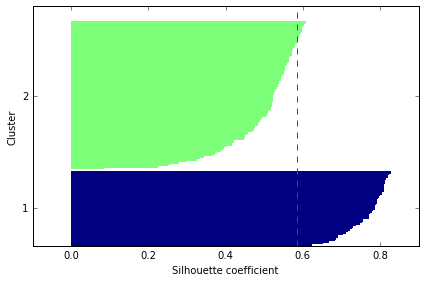


<br>
<br>

# Organizing clusters as a hierarchical tree

[[back to top](#sections)]

One nice feature of hierachical clustering is that we can visualize the results as a dendrogram, a hierachical tree. Using the visualization, we can then decide how "deep" we want to cluster the dataset by setting a "depth" threshold. Or in other words, we don't need to make a decision about the number of clusters upfront.

**Agglomerative and divisive hierarchical clustering**

Furthermore, we can distinguish between 2 main approaches to hierarchical clustering: Divisive clustering and agglomerative clustering. In agglomerative clustering, we start with a single sample from our dataset and iteratively merge it with other samples to form clusters -- we can see it as a bottom-up approach for building the clustering dendrogram.  
In divisive clustering, however, we start with the whole dataset as one cluster, and we iteratively split it into smaller subclusters -- a top-down approach.  

In this notebook, we will use **agglomerative** clustering.

**Single and complete linkage**

Now, the next question is how we measure the similarity between samples. One approach is the familiar Euclidean distance metric that we already used via the K-Means algorithm. as a refresher, the distance between 2 m-dimensional vectors $$\mathbf{p}$$ and $$\mathbf{q}$$ can be computed as:

\begin{align} \mathrm{d}(\mathbf{q},\mathbf{p}) & = \sqrt{(q_1-p_1)^2 + (q_2-p_2)^2 + \cdots + (q_m-p_m)^2} \\[8pt]
& = \sqrt{\sum_{j=1}^m (q_j-p_j)^2}.\end{align}	


However, that's the distance between 2 samples. Now, how do we compute the similarity between subclusters of samples in order to decide which clusters to merge when constructing the dendrogram? I.e., our goal is to iteratively merge the most similar pairs of clusters until only one big cluster remains. There are many different approaches to this, for example single and complete linkage. 

In single linkage, we take the pair of the most similar samples (based on the Euclidean distance, for example) in each cluster, and merge the two clusters which have the most similar 2 members into one new, bigger cluster.

In complete linkage, we compare the pairs of the two most dissimilar members of each cluster with each other, and we merge the 2 clusters where the distance between its 2 most dissimilar members is smallest.


```python
# 生成数据
import pandas as pd
import numpy as np

np.random.seed(123)

variables = ['X', 'Y', 'Z']
labels = ['ID_0','ID_1','ID_2','ID_3','ID_4']

X = np.random.random_sample([5,3])*10
df = pd.DataFrame(X, columns=variables, index=labels)
df
```


<div>
<table border="1" class="dataframe">
  <thead>
    <tr style="text-align: right;">
      <th></th>
      <th>X</th>
      <th>Y</th>
      <th>Z</th>
    </tr>
  </thead>
  <tbody>
    <tr>
      <th>ID_0</th>
      <td>6.964692</td>
      <td>2.861393</td>
      <td>2.268515</td>
    </tr>
    <tr>
      <th>ID_1</th>
      <td>5.513148</td>
      <td>7.194690</td>
      <td>4.231065</td>
    </tr>
    <tr>
      <th>ID_2</th>
      <td>9.807642</td>
      <td>6.848297</td>
      <td>4.809319</td>
    </tr>
    <tr>
      <th>ID_3</th>
      <td>3.921175</td>
      <td>3.431780</td>
      <td>7.290497</td>
    </tr>
    <tr>
      <th>ID_4</th>
      <td>4.385722</td>
      <td>0.596779</td>
      <td>3.980443</td>
    </tr>
  </tbody>
</table>
</div>


<br>

## Performing hierarchical clustering on a distance matrix

[[back to top](#sections)]


```python
# calculate the distance matrix as input for the hierarchical clustering algorithm
from scipy.spatial.distance import pdist,squareform

row_dist = pd.DataFrame(squareform(pdist(df, metric='euclidean')), columns=labels, index=labels)
row_dist
```


<div>
<table border="1" class="dataframe">
  <thead>
    <tr style="text-align: right;">
      <th></th>
      <th>ID_0</th>
      <th>ID_1</th>
      <th>ID_2</th>
      <th>ID_3</th>
      <th>ID_4</th>
    </tr>
  </thead>
  <tbody>
    <tr>
      <th>ID_0</th>
      <td>0.000000</td>
      <td>4.973534</td>
      <td>5.516653</td>
      <td>5.899885</td>
      <td>3.835396</td>
    </tr>
    <tr>
      <th>ID_1</th>
      <td>4.973534</td>
      <td>0.000000</td>
      <td>4.347073</td>
      <td>5.104311</td>
      <td>6.698233</td>
    </tr>
    <tr>
      <th>ID_2</th>
      <td>5.516653</td>
      <td>4.347073</td>
      <td>0.000000</td>
      <td>7.244262</td>
      <td>8.316594</td>
    </tr>
    <tr>
      <th>ID_3</th>
      <td>5.899885</td>
      <td>5.104311</td>
      <td>7.244262</td>
      <td>0.000000</td>
      <td>4.382864</td>
    </tr>
    <tr>
      <th>ID_4</th>
      <td>3.835396</td>
      <td>6.698233</td>
      <td>8.316594</td>
      <td>4.382864</td>
      <td>0.000000</td>
    </tr>
  </tbody>
</table>
</div>


We can either pass a condensed distance matrix (upper triangular) from the pdist function, or we can pass the "original" data array and define the metric='euclidean' argument in linkage. However, we should not pass the squareform distance matrix, which would yield different distance values although the overall clustering could be the same.


```python
# 1. incorrect approach: Squareform distance matrix

from scipy.cluster.hierarchy import linkage

row_clusters = linkage(row_dist, method='complete', metric='euclidean')
pd.DataFrame(row_clusters, 
             columns=['row label 1', 'row label 2', 'distance', 'no. of items in clust.'],
             index=['cluster %d' %(i+1) for i in range(row_clusters.shape[0])])
```


<div>
<table border="1" class="dataframe">
  <thead>
    <tr style="text-align: right;">
      <th></th>
      <th>row label 1</th>
      <th>row label 2</th>
      <th>distance</th>
      <th>no. of items in clust.</th>
    </tr>
  </thead>
  <tbody>
    <tr>
      <th>cluster 1</th>
      <td>0.0</td>
      <td>4.0</td>
      <td>6.521973</td>
      <td>2.0</td>
    </tr>
    <tr>
      <th>cluster 2</th>
      <td>1.0</td>
      <td>2.0</td>
      <td>6.729603</td>
      <td>2.0</td>
    </tr>
    <tr>
      <th>cluster 3</th>
      <td>3.0</td>
      <td>5.0</td>
      <td>8.539247</td>
      <td>3.0</td>
    </tr>
    <tr>
      <th>cluster 4</th>
      <td>6.0</td>
      <td>7.0</td>
      <td>12.444824</td>
      <td>5.0</td>
    </tr>
  </tbody>
</table>
</div>


```python
# 2. correct approach: Condensed distance matrix

row_clusters = linkage(pdist(df, metric='euclidean'), method='complete')
pd.DataFrame(row_clusters, 
             columns=['row label 1', 'row label 2', 'distance', 'no. of items in clust.'],
             index=['cluster %d' %(i+1) for i in range(row_clusters.shape[0])])
```


<div>
<table border="1" class="dataframe">
  <thead>
    <tr style="text-align: right;">
      <th></th>
      <th>row label 1</th>
      <th>row label 2</th>
      <th>distance</th>
      <th>no. of items in clust.</th>
    </tr>
  </thead>
  <tbody>
    <tr>
      <th>cluster 1</th>
      <td>0.0</td>
      <td>4.0</td>
      <td>3.835396</td>
      <td>2.0</td>
    </tr>
    <tr>
      <th>cluster 2</th>
      <td>1.0</td>
      <td>2.0</td>
      <td>4.347073</td>
      <td>2.0</td>
    </tr>
    <tr>
      <th>cluster 3</th>
      <td>3.0</td>
      <td>5.0</td>
      <td>5.899885</td>
      <td>3.0</td>
    </tr>
    <tr>
      <th>cluster 4</th>
      <td>6.0</td>
      <td>7.0</td>
      <td>8.316594</td>
      <td>5.0</td>
    </tr>
  </tbody>
</table>
</div>


```python
# 3. correct approach: Input sample matrix

row_clusters = linkage(df.values, method='complete', metric='euclidean')
pd.DataFrame(row_clusters, 
             columns=['row label 1', 'row label 2', 'distance', 'no. of items in clust.'],
             index=['cluster %d' %(i+1) for i in range(row_clusters.shape[0])])
```


<div>
<table border="1" class="dataframe">
  <thead>
    <tr style="text-align: right;">
      <th></th>
      <th>row label 1</th>
      <th>row label 2</th>
      <th>distance</th>
      <th>no. of items in clust.</th>
    </tr>
  </thead>
  <tbody>
    <tr>
      <th>cluster 1</th>
      <td>0.0</td>
      <td>4.0</td>
      <td>3.835396</td>
      <td>2.0</td>
    </tr>
    <tr>
      <th>cluster 2</th>
      <td>1.0</td>
      <td>2.0</td>
      <td>4.347073</td>
      <td>2.0</td>
    </tr>
    <tr>
      <th>cluster 3</th>
      <td>3.0</td>
      <td>5.0</td>
      <td>5.899885</td>
      <td>3.0</td>
    </tr>
    <tr>
      <th>cluster 4</th>
      <td>6.0</td>
      <td>7.0</td>
      <td>8.316594</td>
      <td>5.0</td>
    </tr>
  </tbody>
</table>
</div>


```python
# 可视化结果, 使用 dendrogram
from scipy.cluster.hierarchy import dendrogram

# make dendrogram black (part 1/2)
# from scipy.cluster.hierarchy import set_link_color_palette
# set_link_color_palette(['black'])

row_dendr = dendrogram(row_clusters, 
                       labels=labels,
                       # make dendrogram black (part 2/2)
                       # color_threshold=np.inf
                       )
plt.tight_layout()
plt.ylabel('Euclidean distance');
#plt.savefig('./figures/dendrogram.png', dpi=300, bbox_inches='tight')
```


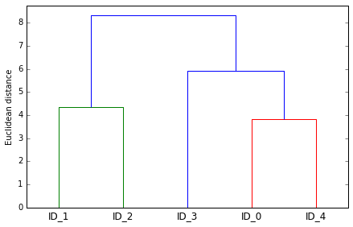


<br>

## Attaching dendrograms to a heat map

[[back to top](#sections)]


```python
# plot row dendrogram
fig = plt.figure(figsize=(8, 8), facecolor='white')
axd = fig.add_axes([0.09, 0.1, 0.2, 0.6])

# note: for matplotlib < v1.5.1, please use orientation='right'
row_dendr = dendrogram(row_clusters, orientation='left')

# reorder data with respect to clustering
df_rowclust = df.ix[row_dendr['leaves'][::-1]]

axd.set_xticks([])
axd.set_yticks([])

# remove axes spines from dendrogram
for i in axd.spines.values():
        i.set_visible(False)

# plot heatmap
axm = fig.add_axes([0.23, 0.1, 0.6, 0.6])  # x-pos, y-pos, width, height
cax = axm.matshow(df_rowclust, interpolation='nearest', cmap='hot_r')
fig.colorbar(cax)
axm.set_xticklabels([''] + list(df_rowclust.columns))
axm.set_yticklabels([''] + list(df_rowclust.index));

# plt.savefig('./figures/heatmap.png', dpi=300)
```


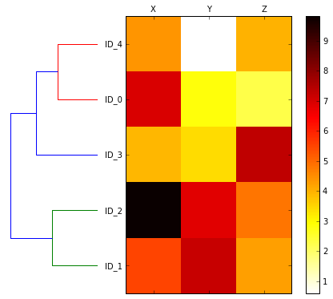


<br>

## Applying agglomerative clustering via scikit-learn

[[back to top](#sections)]


```python
# 前面是用 scipy, 现在用 sklearn 来聚类
from sklearn.cluster import AgglomerativeClustering

ac = AgglomerativeClustering(n_clusters=2, affinity='euclidean', linkage='complete')
labels = ac.fit_predict(X)
print('Cluster labels: %s' % labels)
```

    Cluster labels: [0 1 1 0 0]


结果与前面一致

<br>
<br>

## Applying agglomerative clustering with iris dataset

[[back to top](#sections)]


```python
from sklearn import datasets

iris = datasets.load_iris()
X = iris.data[:, [2, 3]]
y = iris.target
n_samples, n_features = X.shape

plt.scatter(X[:, 0], X[:, 1], c=y);
```


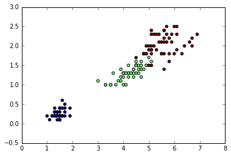


```python
from scipy.cluster.hierarchy import linkage
from scipy.cluster.hierarchy import dendrogram

clusters = linkage(X, 
                   metric='euclidean',
                   method='complete')

dendr = dendrogram(clusters)

plt.ylabel('Euclidean Distance');
```


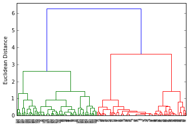


```python
from sklearn.cluster import AgglomerativeClustering

ac = AgglomerativeClustering(n_clusters=3,
                             affinity='euclidean',
                             linkage='complete')

prediction = ac.fit_predict(X)
print('Cluster labels:\n %s\n' % prediction)
```

    Cluster labels:
     [2 2 2 2 2 2 2 2 2 2 2 2 2 2 2 2 2 2 2 2 2 2 2 2 2 2 2 2 2 2 2 2 2 2 2 2 2
     2 2 2 2 2 2 2 2 2 2 2 2 2 0 0 0 1 0 0 0 1 0 1 1 1 1 0 1 1 0 1 0 1 0 1 0 0
     1 1 0 0 0 1 1 1 1 0 0 0 0 1 1 1 1 0 1 1 1 1 1 1 1 1 0 0 0 0 0 0 0 0 0 0 0
     0 0 0 0 0 0 0 0 0 0 0 0 0 0 0 0 0 0 0 0 0 0 0 0 0 0 0 0 0 0 0 0 0 0 0 0 0
     0 0]
    


```python
plt.scatter(X[:, 0], X[:, 1], c=prediction);
```


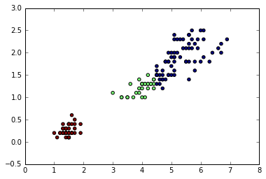


<br>
<br>

# Locating regions of high density via DBSCAN

[[back to top](#sections)]

Another useful approach to clustering is *Density-based Spatial Clustering of Applications with Noise* (DBSCAN). In essence, we can think of DBSCAN as an algorithm that divides the dataset into subgroup based on dense regions of point.

In DBSCAN, we distinguish between 3 different "points":

- Core points: A core point is a point that has at least a minimum number of other points (MinPts) in its radius epsilon.
- Border points: A border point is a point that is not a core point, since it doesn't have enough MinPts in its neighborhood, but lies within the radius epsilon of a core point.
- Noise points: All other points that are neither core points nor border points.


给每个点 label 之后, DBSCAN 算法就是下面两步:
1. Form a separate cluster for each core point or a connected group of core points (core points are connected if they are no farther away than $$\epsilon$$ ).
2. Assign each border point to the cluster of its corresponding core point.

A nice feature about DBSCAN is that we don't have to specify a number of clusters upfront. However, it requires the setting of additional hyperparameters such as the value for MinPts and the radius epsilon.


```python
# 生成半月形数据
# two visible, half-moon-shaped groups consisting of 100 sample points each
from sklearn.datasets import make_moons

X, y = make_moons(n_samples=200, noise=0.05, random_state=0)
plt.scatter(X[:,0], X[:,1])
plt.tight_layout()
#plt.savefig('./figures/moons.png', dpi=300)
```


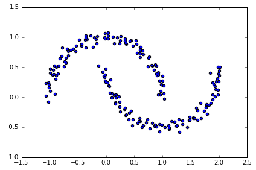


K-means and hierarchical clustering:


```python
# complete linkage clustering
f, (ax1, ax2) = plt.subplots(1, 2, figsize=(8,3))

km = KMeans(n_clusters=2, random_state=0)
y_km = km.fit_predict(X)
ax1.scatter(X[y_km==0,0], X[y_km==0,1], c='lightblue', marker='o', s=40, label='cluster 1')
ax1.scatter(X[y_km==1,0], X[y_km==1,1], c='red', marker='s', s=40, label='cluster 2')
ax1.set_title('K-means clustering')

ac = AgglomerativeClustering(n_clusters=2, affinity='euclidean', linkage='complete')
y_ac = ac.fit_predict(X)
ax2.scatter(X[y_ac==0,0], X[y_ac==0,1], c='lightblue', marker='o', s=40, label='cluster 1')
ax2.scatter(X[y_ac==1,0], X[y_ac==1,1], c='red', marker='s', s=40, label='cluster 2')
ax2.set_title('Agglomerative clustering')

plt.legend()
plt.tight_layout()
#plt.savefig('./figures/kmeans_and_ac.png', dpi=300)
```


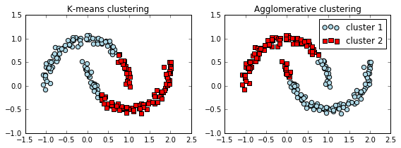


效果并不好, 并不能完全 separated

Density-based clustering:


```python
# DBSCAN
from sklearn.cluster import DBSCAN

db = DBSCAN(eps=0.2, min_samples=5, metric='euclidean')
y_db = db.fit_predict(X)
plt.scatter(X[y_db==0,0], X[y_db==0,1], c='lightblue', marker='o', s=40, label='cluster 1')
plt.scatter(X[y_db==1,0], X[y_db==1,1], c='red', marker='s', s=40, label='cluster 2')
plt.legend()
plt.tight_layout()
#plt.savefig('./figures/moons_dbscan.png', dpi=300)
```


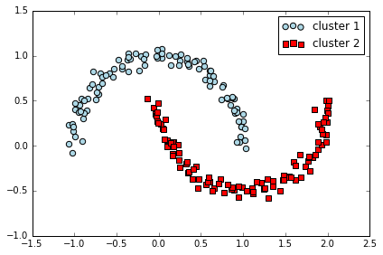


DBSCAN 能很好地对半月数据进行聚类

可以再试试圆环图形


```python
from sklearn.datasets import make_circles

X, y = make_circles(n_samples=500, 
                    factor=.6, 
                    noise=.05)

plt.scatter(X[:, 0], X[:, 1], c=y);
```


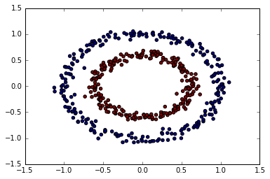


k-means


```python
from sklearn.cluster import KMeans
km = KMeans(n_clusters=2)
predict = km.fit_predict(X)
plt.scatter(X[:, 0], X[:, 1], c=predict);
```


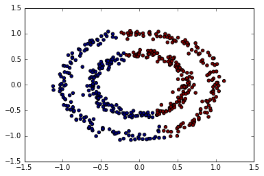


allomerative clustering


```python
from sklearn.cluster import AgglomerativeClustering
ac = AgglomerativeClustering()
predict = ac.fit_predict(X)
plt.scatter(X[:, 0], X[:, 1], c=predict);
```


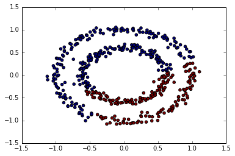


DBSCAN


```python
from sklearn.cluster import DBSCAN
db = DBSCAN(eps=0.15,
            min_samples=9,
            metric='euclidean')
predict = db.fit_predict(X)
plt.scatter(X[:, 0], X[:, 1], c=predict);
```


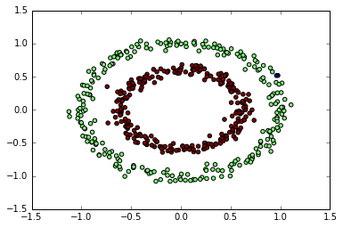


<br>
<br>

# Learning from labeled and unlabeled data with label propagation

[[back to top](#sections)]

因为标注成本比较高，当你的训练数据集只有一部分数据是有标注的情况下，使用监督学习你只能扔掉那些没有标注的 X 。
而实际上，有标注的样本和无标注的样本之间是有关系的，这种关系信息也可以用来帮助学习。这就是半监督学习标签传播（Label Propagation）算法的思路。

它的基本逻辑是借助于近朱者赤的思路，也就是 KNN 的思路，如果 A 和 B 在 X 空间上很接近，那么 A 的 y 标签就可以传给 B。
进一步迭代下去，如果 C 和 B 也很接近，C 的标签也应该和 B 一样。
所以基本计算逻辑就是两步，第一步是计算样本间的距离，构建转移矩阵，第二步是将转移矩阵和 Y 矩阵相乘，Y 里面包括了已标注和未标注的两部分，
通过相乘可以将已标注的 Y 转播给未标注的 Y。
具体论文可以[看这里](http://mlg.eng.cam.ac.uk/zoubin/papers/CMU-CALD-02-107.pdf)。
在 Sklearn 模块中已经内置了这种算法，文档示例可以[看这里](http://scikit-learn.org/stable/modules/label_propagation.html)。
下面是用 Python 的 NumPy 模块实现的一个 toy demo。


```python
import pandas as pd
import numpy as np
```


```python
# 读入 iris 数据
from sklearn.datasets import load_iris
iris = load_iris()
X = iris.data
y = iris.target
n  = len(y)
```


```python
# 切分数据
np.random.seed(42)
train_index = np.random.choice(n, int(0.6*n), replace = False)
test_index = np.setdiff1d(np.arange(n), train_index)
```


```python
# 计算权重矩阵
sigma = X.var(axis = 0)
weights = np.zeros((n,n))

def weight_func(ind1, ind2, X=X, sigma=sigma):
    return np.exp(-np.sum((X[ind1] - X[ind2])**2/sigma))

for i in range(n):
    for j in range(n):
        weights[i,j] = weight_func(i,j)
```


```python
##  标准化为转移矩阵
t = weights / weights.sum(axis=1)
```


```python
# y转换形式
y_m = np.zeros((n, len(np.unique(y))))
for i in range(n):
    y_m[i,y[i]] = 1
```


```python
## unlabel初始化, label记住
y_m[test_index] = np.random.random(y_m[test_index].shape)
clamp = y_m[train_index]
```


```python
## 迭代计算
iter_n = 50
for _ in range(iter_n):
    y_m = t.dot(y_m)  # LP
    y_m = (y_m.T / y_m.sum(axis=1)).T # normalize
    y_m[train_index] = clamp  # clamp
```


```python
#  预测准确率
predict = y_m[test_index].argmax(axis=1)
np.sum(y[test_index] == predict) / float(len(predict))
```


    0.91666666666666663


<br>
<br>

### Label Propagation learning a complex structure 

Example of LabelPropagation learning a complex internal structure to demonstrate “manifold learning”. The outer circle should be labeled “red” and the inner circle “blue”. Because both label groups lie inside their own distinct shape, we can see that the labels propagate correctly around the circle.


```python
import numpy as np
import matplotlib.pyplot as plt
%matplotlib inline
from sklearn.semi_supervised import label_propagation
from sklearn.datasets import make_circles

# generate ring with inner box
n_samples = 200
X, y = make_circles(n_samples=n_samples, shuffle=False)
outer, inner = 0, 1
labels = -np.ones(n_samples)
labels[0] = outer
labels[-1] = inner

# Learn with LabelSpreading
label_spread = label_propagation.LabelSpreading(kernel='knn', alpha=1.0)
label_spread.fit(X, labels)

# Plot output labels
output_labels = label_spread.transduction_
plt.figure(figsize=(8.5, 4))
plt.subplot(1, 2, 1)
plt.scatter(X[labels == outer, 0], X[labels == outer, 1], color='navy',
            marker='s', lw=0, label="outer labeled", s=10)
plt.scatter(X[labels == inner, 0], X[labels == inner, 1], color='c',
            marker='s', lw=0, label='inner labeled', s=10)
plt.scatter(X[labels == -1, 0], X[labels == -1, 1], color='darkorange',
            marker='.', label='unlabeled')
plt.legend(scatterpoints=1, shadow=False, loc='upper right')
plt.title("Raw data (2 classes=outer and inner)")

plt.subplot(1, 2, 2)
output_label_array = np.asarray(output_labels)
outer_numbers = np.where(output_label_array == outer)[0]
inner_numbers = np.where(output_label_array == inner)[0]
plt.scatter(X[outer_numbers, 0], X[outer_numbers, 1], color='navy',
            marker='s', lw=0, s=10, label="outer learned")
plt.scatter(X[inner_numbers, 0], X[inner_numbers, 1], color='c',
            marker='s', lw=0, s=10, label="inner learned")
plt.legend(scatterpoints=1, shadow=False, loc='upper right')
plt.title("Labels learned with Label Spreading (KNN)")

plt.subplots_adjust(left=0.07, bottom=0.07, right=0.93, top=0.92)
plt.show()
```


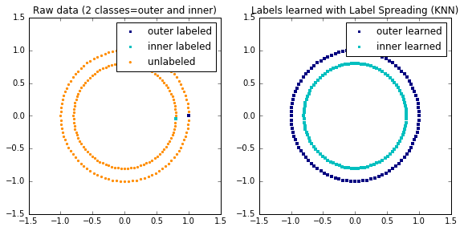


## 练习：使用信贷数据集中的自变量，来对这些用户进行聚类


```python

```
